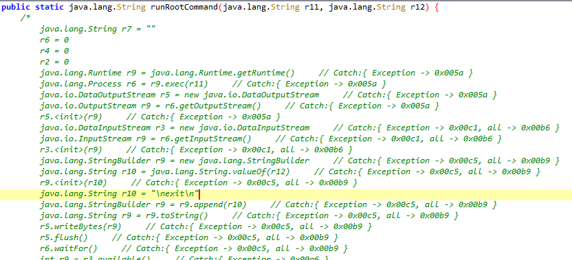
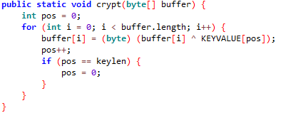
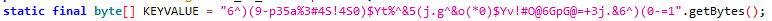
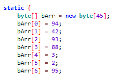
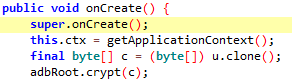
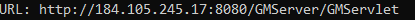

Greetings friends...

Malware analysis reports appear every day, every week and every month. In the content of the reports, we often see statements such as "**Technical analysis revealed an obfuscated IP address**" or "**Decryption revealed a malicious URL**". Well, you did decryption and found the obfuscated URL, but how did you do it? Based on this problem, I realized that there is not much content on how to do decryption in the market. Based on this deficiency, I am starting an informative, educational and advanced technical series on how I analyze and deobfuscate the malware I analyze and deobfuscate. The series is called "**Behind the Curtain!**"

~~(Yes, I did some research after the name came to my mind, I found out that there is such a music group, it has nothing to do with music 🙂 )~~

In 0x01, the first content of the Behind the Curtain series, I will tell you how to statically deobfuscate the obfuscated command and control server in the Android malware **DroidDream**, which we cannot read as plaintext and which appears dynamically after a certain decrypt routine, and how to appear to us in lights. Since it is the first content of the series, we will start a little simple and try to understand the logic of the work.

#### Introduction

The DroidDream malware contains several different constructs. It exploits the system by using a vulnerability of Android, and when a remote connection is made to the relevant binary, it gives ROOT authorization to the attacker. In this series, I'm going to give a preliminary impression of the malware without mentioning it too much, because our topic is not the Malware Analysis Report, but revealing the hidden indicators in that malware. 

First of all, we need a dex decompiler. Of course, this cannot be any other tool than **Jadx**, which will replace IDA during Desktop Malware Analysis! Actually, we could decompile with IDA as it can also decompile dalvik bytecodes, but it's not really fit for purpose for Android malware.  

What are we going to do now? We open our APK file directly with Jadx. Congratulations, you are partially correct. The correct answer is to start Jadx from the command line with the `--show-bad-code` parameter. The reason is that Jadx can't fully parse some methods and present them as Java code when decompiling, so we start with this parameter and say "**Show us as much as you can decompile**". And we still get a nice Java method. If we do not do this operation, the table I will encounter is as follows.



#### Detection of Decrypt Routine

In the introduction, we decompiled our malicious APK in JADX in show-bad-code mode. Now we need to figure out what to deobfuscate. The best way to do this is to trace according to the working hierarchy of the application. In other words, if you start from the main class and ask yourself "what goes where, what parameters does it send?" and try to find a solution, you will suddenly see a piece of code with Xor or mathematical operations like in the image below.



When we examine the Crypt method, it takes a byte type array called buffer as a parameter. The next operation is to increment the variable i by the length of the buffer array one by one and xor the value at the ith index of the array and the value at the pos index of the KEYVALUE array. A nested for loop could have been used, but the attacker chose to increment pos with **pos+++**. The if loop immediately below is not relevant for this case. 

If you ask where the byte array named **KEYVALUE** is, the attacker could have defined it anywhere. But in our example it is defined at the top of the class and the values it contains are interesting.



It has converted a string array into bytes with the **getBytes**() method and defined an array called KEYVALUE of type byte.

### Detection of Obfuscated Data

We detected the Decrypt routine. And it was taking a byte array. In other words, the data to be decrypted must be in a byte array or an array of another data type, but forced to byte data type. When we analyze the application again according to the execution hierarchy, we see a byte array exactly as we were looking for.



Let's say we find a byte array named **bArr** and suspect that it is obfuscated data. So what do we do next? The answer is simple: trace the bArr array. Since we've narrowed the scope to the bArr array, it's really easy.

### Trace Trace Trace!

As you can see from the image, the attacker has made assignments to the byte data type array named bArr of length 45. When we come to the end of the assignments, we see that there is a reference assignment like **u = bArr; **. You can keep in mind that the equivalent of reference assignment in Java is pointer passing in C. The attacker tried to lose his trace here. Now the variable we need to trace is the variable u. And when we continue to analyze a little more, we can see what we are looking for in the upper parts of the onCreate() method.



As you can see, it takes a copy of the array where the data we suspect is obfuscated is stored and its reference is assigned to the variable u, and assigns it to another array of byte data type c. Just below that, it passes c as a parameter to the crypt method, which is the decrypt routine. As a result, the data that we now suspect is obfuscated is decrypted. 

Notice that so far I've used the phrase "data that we suspect is obfuscated" because we're not sure yet and there could be many more sequences like this. You have no idea how the attacker goes out of his way to make the analyst's job harder!

### Time to Be Sure and C#

What we have done so far is to trace the whole application and then analyze the decrypt routine and the algorithm of how the obfuscated data is sent to the decrypt routine. Now it's time to prove our theories and write some code. 

The first thing we are going to do is definitions. First we define the Xor keys. Then we define the obfuscated bArr array and all its contents.

```csharp
    string KEYVALUE = "6^)(9-p35a%3#4S!4S0)$Yt%^&5(j.g^&o(*0)$Yv!#O@6GpG@=+3j.&6^)(0-=1";
                byte[] anahtar = Encoding.UTF8.GetBytes(KEYVALUE); //Stringi byte olarak alıyoruz.
                byte[] bArr = new byte[45];
                bArr[0] = 94;
                bArr[1] = 42;
                bArr[2] = 93;
                bArr[3] = 88;
                bArr[4] = 3;
                bArr[5] = 2;
                bArr[6] = 95;
                bArr[7] = 2;
                bArr[8] = 13;
                bArr[9] = 85;
                bArr[10] = 11;
                bArr[11] = 2;
                bArr[12] = 19;
                bArr[13] = 1;
                bArr[14] = 125;
                bArr[15] = 19;
                bArr[17] = 102;
                bArr[18] = 30;
                bArr[19] = 24;
                bArr[20] = 19;
                bArr[21] = 99;
                bArr[22] = 76;
                bArr[23] = 21;
                bArr[24] = 102;
                bArr[25] = 22;
                bArr[26] = 26;
                bArr[27] = 111;
                bArr[28] = 39;
                bArr[29] = 125;
                bArr[30] = 2;
                bArr[31] = 44;
                bArr[32] = 80;
                bArr[33] = 10;
                bArr[34] = 90;
                bArr[35] = 5;
                bArr[36] = 119;
                bArr[37] = 100;
                bArr[38] = 119;
                bArr[39] = 60;
                bArr[40] = 4;
                bArr[41] = 87;
                bArr[42] = 79;
                bArr[43] = 42;
                bArr[44] = 52;
```
One thing to note is that the attacker used the getBytes() method in Java in default format. So he converted it from UTF8 to bytes. We do this by specifying this in C#. There is no direct use in C# as in Java.


We start writing our method called Decrypt.

```csharp
  public void decrypt(byte[] dizi, byte[] anahtar)
            {
                int i;
                for(i = 0; i < dizi.Length; i++)
                {
                    dizi[i] = (byte)(dizi[i] ^ anahtar[i]);
                }
                string urlPlain = Encoding.UTF8.GetString(dizi); 
                Console.Write("URL: " + urlPlain)
            }
```

As you can see in the code fragment, we did not take the pos variable into account at all. All we did was to xor the array named array and the key array with the corresponding value at index i.  Since the value in the array is in bytes, we converted the bytes to strings in UTF8 format with C#'s GetString() method and outputted them to the screen and the result was a smile 🙂



You can see the full code here. You can also download it from Github Gist. 

In episode 0x01 of the Behind the Curtain series, I explained how to write a decryption code for the Android malware Droid Dream to bring all the indicators to light. If you have any questions or suggestions, let me know in the comments. In the meantime, I am leaving the hash of the DroidDream malware here for you to practice. If you wondered, "They always put it at the top of the page, why do you put the hash at the bottom", I can answer that I think it is better to listen to the topic fully and then practice 🙂 

See you in the next part of the series, stay safe...

`DroidDream MD5 HASH: ecad34c72d2388aafec0a1352bff2dd9 `