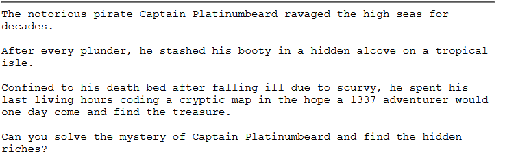
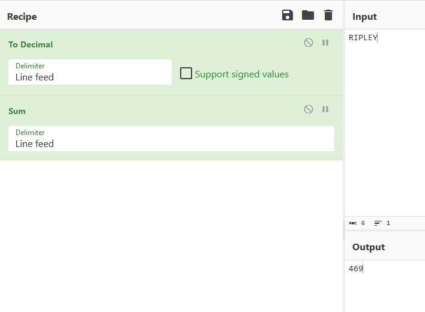
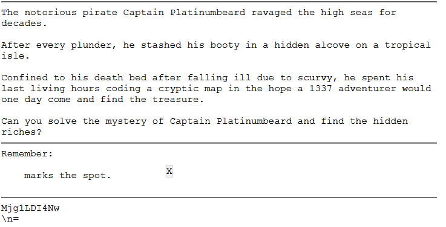
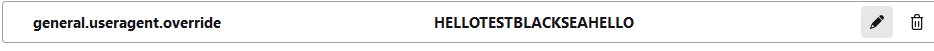
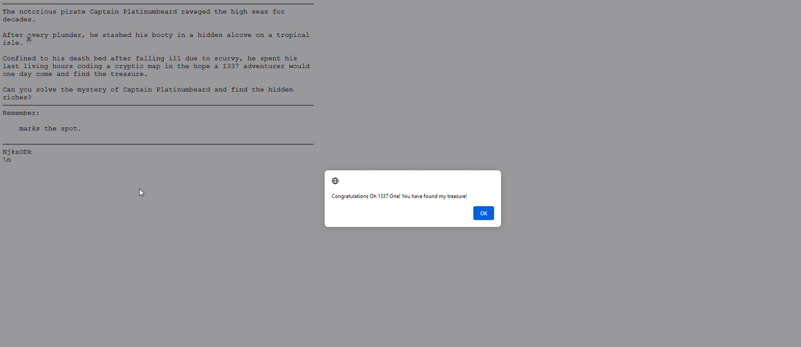

In this post, I'll trying to explain JavaScript reversing basics and approaches with simple crack-me challenge in order to realize inner-workings of typical JS challenge. 

## Challenge



This challenge came to me as private email from a company, so I don't think to release whole challenge to public for the rights of company. So let's start to digging deep!

When I first entered the page, I noticed the **long loading time** and realized that JS code was running in the background. I started to analyze the source code of the page. When I was given the challenge, I decided to do an in-depth technical analysis, otherwise it would have taken me minutes with JS Debugger to locate the treasure.

First of all, the JS codes in the script tags caught my attention and I started to analyze each stage. 

```js
let ee = eval("\145\x76" + atob("yw".toUpperCase() + "w=")), b = atob;
```

A basic obfuscation was tried to be applied in the expression.`\145` is octal, `\x76` is hexadecimal encoded and the string equivalent is `ev`. `YWw=` is generated with string concantate and **BASE64** decoded with atob. As a result, `ee = eval` and `b = atob` in this line. 

The values in the spikes array appear to be BASE64, but when I try to decode it, I get an expression like "`ÑserAgen]`". According to my first guess, this string will actually be deobfuscated and converted to values like "`UserAgent`". 

```js
let tY = (function(){
    function n(s){
        bb = s[0], nn = s[s.length-1];
        return nn + s.substring(1, s.length-1) + bb; // nserAgen]Ñ
    }
    return n;
})()
```

When I look at the function above, I see that a simple string subtraction is performed and the new string is returned. `bb` holds the first character of the string given as a parameter to the function and `nn` holds the last character. And then it returns a new string as follows: **last character + all characters except first and last character + first character**. 

When I continue analyzing the code, I realize that my guess is correct because the BASE64 values in the `spikes` array are first given to the `tY()` function for a simple BASE64 **deobfuscation** and then decoded. 

```js
let clue = (function(){
    if (window[b(tY(spikes[0x00]))][b(tY(spikes[0x01]))].indexOf(b(tY(spikes[0x06]))) == 9){
        return b(tY(spikes[0x04]));
    } else {
        return b(tY(spikes[0x03])); 
    }; 
})();
```

I analyze the inline `clue()` function, which is the first function where BASE64 string deobfuscation is performed. According to the deobfuscation scheme I extracted;

```js
b(tY(spikes[0])) -> navigator
b(tY(spikes[1])) -> userAgent
b(tY(spikes[2])) -> indexOf
b(tY(spikes[3])) -> LAMBERT
b(tY(spikes[4])) -> RIPLEY
b(tY(spikes[5])) -> ALDERSON
b(tY(spikes[6])) -> BLACKSEA
b(tY(spikes[7])) -> dir
b(tY(spikes[8])) -> clear
b(tY(spikes[9])) -> clue
b(tY(spikes[10])) -> canary
b(tY(spikes[11])) -> alpha
b(tY(spikes[12])) -> beta
b(tY(spikes[13])) -> gamma
```

I simulate my deobfuscation operations in script tags that I wrote in a simple HTML template.

```html
<html>
    <body>
    <h1>Simple JS Executor</h1>
    <p id="result"></p>
    <script>
        document.getElementById("result").innerHTML = "";
        function PrintResult(res){
            document.getElementById("result").innerHTML += res;
        }

        function Deobf(s){
            bb = s[0], nn = s[s.length-1];
            return atob(nn + s.substring(1, s.length-1) + bb);
        }

        function main(){
            let spikes = ["ymF2aWdhdG9b", "0XNlckFnZW5d", "=W5kZXhPZg=a", "=EFNQkVSVA=T", "ZklQTEVU", "=UxERVJTT04Q", "=kxBQ0tTRUEQ", "yGlZ", "=2xlYXIY", "=2x1ZQ=Y", "52FuYXJY", "=WxwaGEY", "=mV0YQ=Y", "=2FtbWEZ"];
            for(let i = 0; i < spikes.length; ++i){
                PrintResult("b(tY(spikes["+ i +"])) -> " + Deobf(spikes[i]) + "<br>");
            }
        }

        main();

    </script>

    </body>
</html>
```

After deobfuscate, the function looks like this:

```js
let clue = (function(){
    if (window["navigator"]["userAgent"].indexOf("BLACKSEA") == 9){
        return "RIPLEY";
    } else {
        return "LAMBERT"; 
    }; 
})();
```

As we can understand from the algorithm, if "`BLACKSEA`" is present in the **9th index** of the User-Agent string, the string "`LAMBERT`" is returned, if not, the string "`RIPLEY`" is returned and the clue now represents the returned value. 

```js
            var el = new Image();
            Object.defineProperty(el, 'id', {
                get: function () {
                    clue = b(tY(spikes[0x05]));
                }
            });         
            requestAnimationFrame(function check() {
                console.dir(el);
                console.clear();
                requestAnimationFrame(check);
            });
```

In the above code fragment, a new `Image` object is created and a function is defined that sets the "`clue`" variable "`ALDERSON`" to the "`id`" property of this object. Then all the attributes of the hand object are output to the console but are cleared immediately. 

```js
            setInterval(() => {
                ee('dLb'.replace('L', 'e') +'ug' + '14r'.replace('14', 'ge')); //eval('debugger');
                if (runes.length > 2 && (function (targ) {
                                            tt = 0;
                                            for (i = 0; i < targ.length; i++) {
                                                tt += targ.charCodeAt(i);
                                            }
                                            return tt == 469;
                                        })(clue)){
                    ee(b("YWxlcn"+"QoIkNvbmdy"+"YXR1bGF0aW9uc"+"yBPaCAxMzM3I"+"E9uZSEgWW91IGh"+"hdmUgZm91bmQgbXkg"+"dHJlYXN1cmUhIik="));
                    runes=[];
                }
            }, 2000);
```

It has given a directive to run **every 2 seconds** with the `setInterval `method. In the given directive, it is first made difficult to debug with the `debugger `statement. Because a new debug session will be opened after 2 seconds, the code will not be analyzed correctly. 

One of the most important points that attracts our attention and will lead us to the result is the function itself in the if condition of the function. It sums the decimal equivalents of each character of the string passed as a parameter and contained in the `clue` variable and requires the value of this sum to be **469** to reach the result. The value that provides this is "`RIPLEY`". The CyberChef recipe that makes the relevant calculation is as shown in the figure. 



In order for the clue variable to be "`RIPLEY`", as I mentioned before, the **9th index** of the browser User-Agent must be "`BLACKSEA`". When these conditions are met, it outputs `alert("Congratulations Oh 1337 One! You have found my treasure!")`. 

## Going Through Entrypoint

In general, we have managed to make sense of all the complex parts of the JavaScript code. From this point on, it will be more useful to analyze from the entrypoint. For this, let's start by analyzing the `stage()` function defined in the onload action in the body tag. 

```js
function stage(){
    document.location.hash='';
    d(document.getElementById("c"+"an"+"ar"+"y"));
}
```

The `stage()` function completes its task by giving only the div element with id "`canary`" as a parameter to the d function. The JS beautified version of the `d()` function is as follows:

```js
function d(e) {
    var n = 0,
        t = 0,
        o = 0,
        u = 0;

    function d(e) {
        (e = e || window.event).preventDefault(), o = e.clientX, u = e.clientY, document.onmouseup = c, document.onmousemove = l
    }

    function l(d) {
        (d = d || window.event).preventDefault(), n = o - d.clientX, t = u - d.clientY, o = d.clientX, u = d.clientY, e.style.top = e.offsetTop - t + "px", e.style.left = e.offsetLeft - n + "px", IChing(u, o)
    }

    function c() {
        document.onmouseup = null, document.onmousemove = null
    }
    document.getElementById(e.id + "header") ? document.getElementById(e.id + "header").onmousedown = d : e.onmousedown = d
}
```

If an HTML object with id "`canaryheader`" is present in the page, `onmousedown` event is defined for this object. Otherwise, this event is defined to the "div" element with the id "canary". Since there is only "div" element with "canary" id on the page, any mouse button click on this element calls the inline `d()` function. 

In the nested `d()` function, `onmouseup `and `onmousemove` event callback functions are defined as `c()` and `l()` respectively. It also stores the **x and y coordinates** of the mouse in variables **o and u** respectively. Although the assignment to these variables is done within the function, their definition is done within the **main** d() function, so they will be valid in the entire function scope.  In addition, in the **nested** `d()` function, if an event is already defined for the `e` object passed as a parameter to the function, the creation of these events is prevented by the "`preventDefault`" method. 

The callback function of the "`onmouseup`" event was assigned as `c()`. But when we take a look at the `c()` function, I see that `onmouseup` and `onmousemov` events are reset. But in the `l()` function, which is the callback function of the "`onmousemove`" event, I realize that there is a part that will lead us to the main result. In short, we are asked to click on **"X**" and **drag **it on the page.



As you can see in the image, my analysis was correct, and now I'm focusing on the `l()` function, which is the point I need to focus on.

To explain the `l()` function in a simple way; it takes the delta difference between the old mouse location and the new mouse location and stores this difference in the `n` and `t` variables valid in the scope of the **main** `d()` function. It sends the old mouse location information to the `IChing()` function as `y` and `x` parameters respectively.

In the first line of the `IChing()` function, `document.getElementById("gps").innerHTML = btoa(y.toString() + "," + x.toString()).replace("=", "\n\<br>\\n");` shows the `y` and `x` coordinates on the page in BASE64 encode. In order to find the captain's treasure, all conditions must be met in the function, because when the conditions are met, 3 values will be pushed to the `runes` array and the captain will tell us that we have found his treasure as a result of being checked by the function running once every 2 seconds. 

```js
y == clue.charCodeAt(0) && x == clue.charCodeAt(1) && !runes.length
```

We have already mentioned that the string that must be contained in the `clue` variable must be "`RIPLEY`". According to the first condition, the `x` coordinate (**remember that the actual coordinates are sent as y,x when the function is called!**) must be equal to **82**, the decimal equivalent of the character '**R**', and the **y** coordinate must be equal to **73**, the decimal equivalent of the character '**I**'. And the "`runes`" array must be empty. 

According to the second condition, in the second `onmousemove `event, the x coordinate must be equal to **80 **which is the decimal equivalent of the character '**P**' and the **y** coordinate must be equal to **76 **which is the decimal equivalent of the character '**L**'.

In the third condition, the same checks are made and the x and y coordinates must be equal to **69** and **89**, which are the decimal equivalents of the last two letters of the value in the `clue` variable. When all these conditions are met, we successfully find the captain's treasure.

## FIND THE TREASURE!

We found out how the captain hid his treasure through analysis. Rather than dragging the X marker ourselves and constantly checking the encode BASE64 expression, I think it is better to write a **Python** script that can simulate the drag action to ensure the accuracy of this analysis. But before we do that, let's change the **User-Agent** of our browser as desired.



I'm developing my Python script using the **pyAutoGUI** library, but since it runs on the entire desktop and not in the browser, I need to put my browser in full screen mode and calculate the **offset difference** of the initial position. 

For this, I make small manipulations in the HTML page and output my instant coordinate data and the script starts working properly.

```python
import time
import pyautogui

# Firstly we must get the mouse cursor over the X mark by manually in the 5 seconds. 
# But we must consider between deltas browser screen and HTML page, 
# so get the fullscreen mode on browser due to working properly of script.
time.sleep(5)

# And after, drag to mouse that have to met the first condition.
pyautogui.dragTo(84, 67, 2, button='left') # +2, -9 delta 
pyautogui.dragTo(80, 76, 2, button='left')
pyautogui.dragTo(69, 89, 2, button='left')
```

And we have successfully found Captain's treasure!


