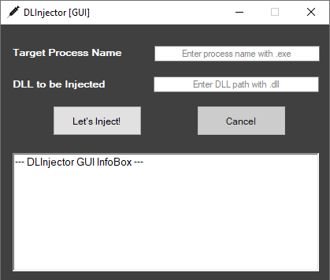

While analyzing malware, I come across different "**Process Injection**" techniques, the most obvious of which is undoubtedly DLL injection. Of course, we should not marginalize injection methods as only malicious applications use them. In addition to security solutions such as anti-virus, EDR, many applications can also use Process injection methods.

While realizing the projects that came to my mind and in order to move more easily on the target process, I was frequently using DLL injection method, which is one of the Process injection techniques. But in every project I did, I was writing the DLL injection module separately, over and over again. Then when I realized that I was in this cycle, I decided to write a practical and fast DLL Injector that would make things easier. And DLInjector came out.

DLInjector injects DLLs in a simple way using a technique called **classical DLL injection** or **CreateRemoteThread** DLL injection. Normally we need the handle of the target remote process and we can get the required handle in different ways. For simplicity, DLInjector gets the handle from the target process name. And if the process is not on the system yet, it waits to inject the target DLL until it starts.

DLInjector has 2 different versions, CLI and GUI. I wouldn't normally code the GUI version, but for some people a graphical interface is more convenient.

I have a few ideas about new versions of DLInjector, I'm thinking of releasing them in the next releases. If you have a different, innovative idea in mind, I'm waiting for your Pull Requests, friends 🙂

- **DLInjector CLI:** [https://github.com/fatihsnsy/DLInjector-CLI](https://github.com/fatihsnsy/DLInjector-CLI)
- **DLInjector GUI:** [https://github.com/fatihsnsy/DLInjector-GUI](https://github.com/fatihsnsy/DLInjector-GUI)