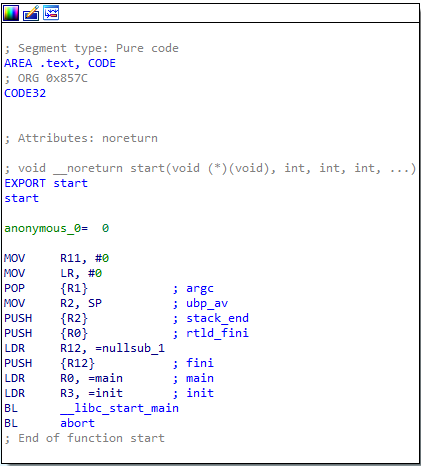
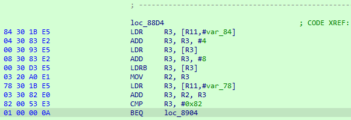
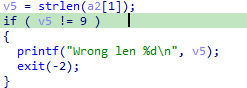
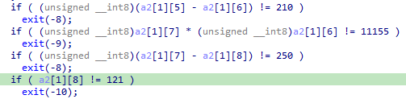
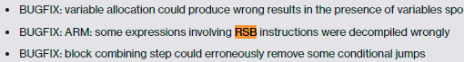
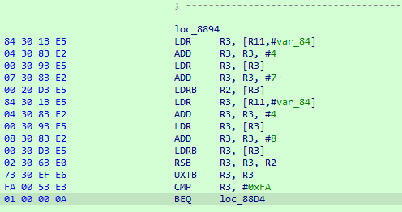
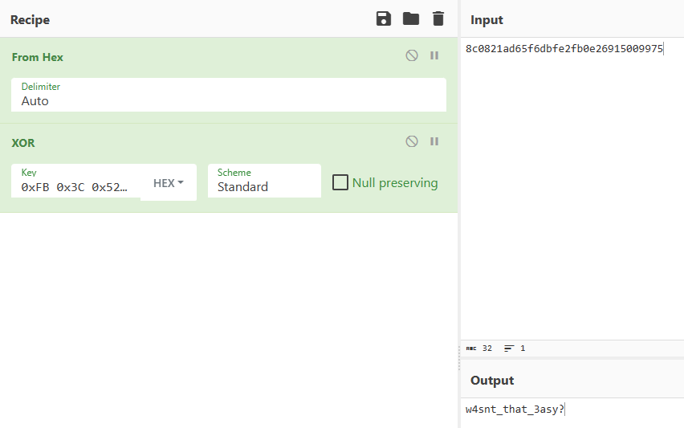

When I encountered the challenge, I first examined the ELF header and decided to proceed by inspecting the ELF file headers. I observed that the binary was written for the ARM architecture, and since I didn't have an ARM machine at my disposal, I set up the necessary environment using the QEMU ARM emulator. Additionally, I installed older shared libraries like **libssl1.0.0** on my Linux machine for the potential dynamic analysis phase. On the other hand, I utilized my Windows machine for static analysis. For this purpose, I configured the IDA GDB server for remote debugging. 

> But the weirdiest thing that I came across, IDA's decompilation feature couldn't handle the reverse substract instruction of ARM. So I've decided to change the color of this basic ARM crack-me challenge and explain the what actions should be perform like this situation. 

## Inspection to ARM Binary

Binary is a 32-bit ARM executable that use some of the shared libraries. So if I decide to execute this binary, I must use ARM emulator or execute at the native ARM environment. In my case, I decided to use `qemu-arm` emulator on Linux system. 

I already mentioned that my possible analysis strategy. So let's begin analyzing the binary like a real reverse-engineer! When I dragged the binary to IDA for analysis, IDA mentioned that this binary use THUMB and ARM instructions. And after the finishing initial auto-analysis, I jump to `start` procedure of binary. 



As you can see, `libc` will handle the execution of `init` and `main` functions. Firstly I analyzed `init` function for possible some executions before the main, but I didn't face anything and I decided to look inside `main` function. 

`Main` function is a basic, non-obfuscated procedure that basically performs these steps:

- Calculate the length of the given argument of binary by accessing to `argv` structure and calling the `strlen` function. 

- If  the length of the argument is not 9, exit the program. 

- Calculate every characters of the argument with some basic mathematical operations and decide whether to move forward or exit the program. 

- If everything fine, calculate the MD5 hash of the given argument and XOR every characters with `0xFB, 0x3C, 0x52, 0xC3, 0x11, 0xA9, 0xAF, 0x96, 0x4E, 0xC4, 0xBD, 0x5A, 0x74, 0x73, 0xE0, 0x4A` byte array. 

Now that I have explained the algorithm basics, I can move on to finding the key. The application expects the key length to be 9 for execution and perform arithmetic operations on this key value by accessing the key index `0 to 8`. I don't suggest relying solely on the IDA pseudo-C view because of potential misinterpretation of arithmetic operations. In my case, this happened. **IDA decompiler can't properly interpret some of the values because it doesn't handle the RSB instruction properly**, so I should focus on looking at the ARM assembly output and taking some notes.

Let's  assign pseudo name to each characters of the key. 

```bash
key[0] = a
key[1] = b
key[2] = c
key[3] = d
key[4] = e
key[5] = f
key[6] = g
key[7] = h
key[8] = i
```

After that set the equations for these variables.

```
b * a = 0x1353
b - c = 0xee
d * c = 0x365b
d - e = 0x9
f * e = 0x1650
f - g = 0xd2
h * g = 0x2b93
h - i = 0xfa
```

## Hidden In Plain Sight

The only thing left is finding the variable `i` and that showed up before the MD5 calculation procedure. 



According to the ARM output shown above, `R11` register behaves as the frame-pointer, and the given key argument is located at `R11 + var_84` offset. The length of the key is located the `R11 + var_78` offset. So I already know what size should be the key, it's `9`. 



So `var_78` holds the value of `9`. According to the calculation, sum of the `R2` and `R3` registers (`R3` holds value of 9, `R2` holds `key[8]` named as `i`) must be equal to `0x82`. We can perform reverse operation of `add` instruction, which is substraction, the `i` variable becomes `0x79`. 

### RSB 

> Reverse Subtract without carry.
>
> RSB{S}{*cond*} {*Rd*}, *Rn*, *Operand2*
> 
> where:
>
> - `S`
>
>   is an optional suffix. If S is specified, the condition flags are updated on the result of the operation.
>
> - `*cond*`
>
>   is an optional condition code.
>
> - `*Rd*`
>
>   is the destination register.
>
> - `*Rn*`
>
>   is the register holding the first operand.
>
> - `*Operand2*`
>
>   is a flexible second operand.

At this section, IDA doesn't show the decompilation properly because **it cannot handle RSB instruction** as it's supposed to be:



I don't know what is the reason of why IDA cannot handle RSB instruction, but I think this is a bug that was allegedly resolved in 2012 and still exists and I still wonder what lies behind this.  



This is the reason of why I'm going through reading ARM assembly output on crack-me challenge instead of only looking the generated pseudo-C output, and I'd strongly recommend it :)

I've already found `i` variable (`key[8]`), so I can proceed to locate other variables and complete the proper key calculation in reverse order.  Now that I have the value of `i`, I can substitute it in the equation and get all the values, right? I wish it were that simple. However, if I rely solely on straightforward logic at this point, I won't reach the result because I need to analyze some of the instructions in the ARM set.



Let's take a look at the output above to find the value of `h`. That procedure basically perform reverse substract with `RSB` instruction and extract the 8-bit value from the result with `UXTB` instruction. But we must keep our mind that only one byte loaded the registers from the characters of key value, so signed operations involved this phase. `R2 - 0x79` should be `0xFA`, but if we assume `R2` is `0x173` we'd be thinking wrong way because, it is not one byte and it cannot be the input because it is not a value in the ASCII table. So we should give the value that lower than `0x79` and then, result turns to negative 0xFFFF thing. We can basically calculate the input the basic math like: 

`0x79 - ((0xFF - 0xFA) + 1)`. Result of this operations is will become `0x73`, so `h` value (`key[7]`) too. 

After that we can find the value of `g` with calculate the `0x2b93 / h`, and this results `0x61`. Other calculations same as we already performed. After the making the all calculations proper key revealed: `3asyp3asy`

We can move the last part of this challenge, calculate the MD5 hash of `3asyp3asy` and perform XOR operation with every single characters in the byte array and construct CyberChef recipe for solution:



## Conclusion

Reverse engineering on ARM binaries might be challenging rather than other generic architectures. I'd recommend step-by-step analysis on every architecture and every binaries as well because IDA, Ghidra, Binary Ninja and other disassemblers just only tools, just like I analyzed. So true reverse engineering process highly consist on going to further details inside those binaries.  The main idea behind this article is: **Never trust any output that doesn't belong to you!**

Thanks for reading...