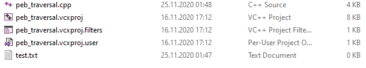

The battle between threat actors and malware analysts is becoming more and more critical with new techniques, tools and know-how emerging. Threat actors are coming up with different techniques to avoid analysts and security products. In this technical article, I will show you the details of PEB Traversal, an increasingly popular technique, and its implementation with a small example. 

## What is PEB?

PEB, which stands for Process Environment Block, is a data structure in the Windows operating system. In this data structure;
 - global contexts, 
 - initial parameters of the program, 
 - image base address of the program, 
 - synchronization elements used to ensure mutual exclusion, 
 - the structure of the modules loaded in the program's memory space

elements such as the following. The PEB structure is shown below:

```cpp
typedef struct _PEB {
  BYTE                          Reserved1[2];
  BYTE                          BeingDebugged;
  BYTE                          Reserved2[1];
  PVOID                         Reserved3[2];
  PPEB_LDR_DATA                 Ldr;
  PRTL_USER_PROCESS_PARAMETERS  ProcessParameters;
  PVOID                         Reserved4[3];
  PVOID                         AtlThunkSListPtr;
  PVOID                         Reserved5;
  ULONG                         Reserved6;
  PVOID                         Reserved7;
  ULONG                         Reserved8;
  ULONG                         AtlThunkSListPtr32;
  PVOID                         Reserved9[45];
  BYTE                          Reserved10[96];
  PPS_POST_PROCESS_INIT_ROUTINE PostProcessInitRoutine;
  BYTE                          Reserved11[128];
  PVOID                         Reserved12[1];
  ULONG                         SessionId;
} PEB, *PPEB;
```

PEB is a must-have for processes running in user-mode. The reason why such a critical structure runs in user-mode is that it is designed to be used by other user-mode APIs, such as image loaders and heap managers, which run outside of kernel mode, and are included in operating system libraries such as NTDLL. 

## How Threat Actors Use PEB

We mentioned that there is a structure in the PEB that accesses the modules that exist in the process's memory space. This structure called PEB_LDR_DATA can be summarized as follows:

```cpp
typedef struct _PEB_LDR_DATA {
  BYTE       Reserved1[8];
  PVOID      Reserved2[3];
  LIST_ENTRY InMemoryOrderModuleList;
} PEB_LDR_DATA, *PPEB_LDR_DATA;
```

Threat actors often use PEB Traversal, an API Resolving technique, to evade anti-virus systems. In order to fully implement the PEB Traversal technique, two things are needed. First, we need a function that accesses the PEB_LDR_DATA structure in the PEB structure, which holds information about the modules loaded for the process, and traverses all the modules and all the functions (APIs) exported by the modules and performs a hash comparison, and then we need a hash function, which is the basis of the work. Now let me put these pieces together and list a pseudo algorithm of the PEB Traversal technique.

1. Our traversal function sends the hardcoded name of each exported API to the hash function. 
2. The hash function calculates a hash value according to its own structural algorithm and returns this value. 
3. The returned value is compared with the hardcoded hashes in the malware. These hardcoded hash values are the previously obtained values of the Windows APIs that the threat actors want to use. 
4. If the hash values obtained by Traversal at runtime match the hash values previously calculated and hardcoded by the threat actor, another variable holds the address of the matching API in memory. In other words, it does what the classic LoadLibrary and GetProcAddress APIs would have done up to this point, without being caught by AV detection. 


## Let's Implement!

We have already explained our pseudo algorithm above, now it's time to implement it in real code. The code block below explains everything sufficiently. In addition, referring back to the "we need to choose or generate a hashing algorithm" part I mentioned above, let me also mention that I chose the DJB2 hashing algorithm in my example. 

```cpp

#include <windows.h>
#include <winternl.h> // PEB structure defined in this library
#include <iostream>

using namespace std;

// Redefine your own CreateFile func. Because we will point to the HMODULE structure returning from the PEB Traversal technique.  

typedef HANDLE(WINAPI *MY_CREATE_FILE)(
	LPCSTR                lpFileName,
	DWORD                 dwDesiredAccess,
	DWORD                 dwShareMode,
	LPSECURITY_ATTRIBUTES lpSecurityAttributes,
	DWORD                 dwCreationDisposition,
	DWORD                 dwFlagsAndAttributes,
	HANDLE                hTemplateFile
);

// Redefine PEB structures. The structure definitions in winternl.h are incomplete.
typedef struct _MY_PEB_LDR_DATA {
	ULONG Length;
	BOOL Initialized;
	PVOID SsHandle;
	LIST_ENTRY InLoadOrderModuleList;
	LIST_ENTRY InMemoryOrderModuleList;
	LIST_ENTRY InInitializationOrderModuleList;
} MY_PEB_LDR_DATA, * PMY_PEB_LDR_DATA;

typedef struct _MY_LDR_DATA_TABLE_ENTRY
{
	LIST_ENTRY InLoadOrderLinks;
	LIST_ENTRY InMemoryOrderLinks;
	LIST_ENTRY InInitializationOrderLinks;
	PVOID DllBase;
	PVOID EntryPoint;
	ULONG SizeOfImage;
	UNICODE_STRING FullDllName;
	UNICODE_STRING BaseDllName;
} MY_LDR_DATA_TABLE_ENTRY, * PMY_LDR_DATA_TABLE_ENTRY;


unsigned long calc_djb2(unsigned char* func_hash) {

	unsigned long hash = 5381;

	int hash_chr;

	while (hash_chr = *func_hash++)
		hash = ((hash << 5) + hash) + hash_chr;

	return hash;

}

HMODULE get_api_address(DWORD dwModuleFunctionHash)
{
	PPEB peb_addr;
	PMY_PEB_LDR_DATA pLdr;
	PLIST_ENTRY pNextModule;
	PMY_LDR_DATA_TABLE_ENTRY pDataTableEntry;
	PVOID pModuleBase;
	PIMAGE_NT_HEADERS pNTHeader;
	DWORD dwExportDirRVA;
	PIMAGE_EXPORT_DIRECTORY pExportDir;
	DWORD dwNumFunctions;
	USHORT usOrdinalTableIndex;
	PDWORD pdwFunctionNameBase;
	PCSTR pFunctionName;
	UNICODE_STRING BaseDllName;
	DWORD dwFunctionHash;
	PCSTR pTempChar;

	DWORD i;

#ifdef _WIN64
	peb_addr = (PPEB)__readgsqword(0x60);

#else 
	peb_addr = (PPEB) __readfsdword(0x30);

#endif
	pLdr = (PMY_PEB_LDR_DATA)peb_addr->Ldr;
	pNextModule = pLdr->InLoadOrderModuleList.Flink;
	pDataTableEntry = (PMY_LDR_DATA_TABLE_ENTRY)pNextModule;
	while (pDataTableEntry->DllBase != NULL)
	{
		pModuleBase = pDataTableEntry->DllBase;
		BaseDllName = pDataTableEntry->BaseDllName;
		pNTHeader = (PIMAGE_NT_HEADERS)((ULONG_PTR)pModuleBase + ((PIMAGE_DOS_HEADER)pModuleBase)->e_lfanew);
		dwExportDirRVA = pNTHeader->OptionalHeader.DataDirectory[0].VirtualAddress;

		pDataTableEntry = (PMY_LDR_DATA_TABLE_ENTRY)pDataTableEntry->InLoadOrderLinks.Flink;

		if (dwExportDirRVA == 0)
		{
			continue;
		}

		pExportDir = (PIMAGE_EXPORT_DIRECTORY)((ULONG_PTR)pModuleBase + dwExportDirRVA);

		dwNumFunctions = pExportDir->NumberOfNames;
		pdwFunctionNameBase = (PDWORD)((PCHAR)pModuleBase + pExportDir->AddressOfNames);
		
		for (i = 0; i < dwNumFunctions; i++)
		{
			dwFunctionHash = 0;
			pFunctionName = (PCSTR)(*pdwFunctionNameBase + (ULONG_PTR)pModuleBase);
			pdwFunctionNameBase++;

			dwFunctionHash = calc_djb2((unsigned char *)pFunctionName);

			if (dwFunctionHash == dwModuleFunctionHash)
			{
				usOrdinalTableIndex = *(PUSHORT)(((ULONG_PTR)pModuleBase + pExportDir->AddressOfNameOrdinals) + (2 * i));
				return (HMODULE)((ULONG_PTR)pModuleBase + *(PDWORD)(((ULONG_PTR)pModuleBase + pExportDir->AddressOfFunctions) + (4 * usOrdinalTableIndex)));
			}
		}
	}

	return NULL;

}


int main()
{
	MY_CREATE_FILE NewCreateFile;
	//3952526842 -> CreateFileA
	NewCreateFile  = (MY_CREATE_FILE)get_api_address(3952526842);
	NewCreateFile("test.txt", GENERIC_READ | GENERIC_WRITE, 0, NULL, 2, 128, NULL);

	return 0;
}

```

I simplified the code example I referenced for those who are new to this technique. In our example, we simply called the CreateFileA API in the kernel32.dll module with the PEB Traversal technique without using it directly. And the result: 



I will be debugging the comments if there is a point you do not understand. Have a healthy day...

## References 
- https://theartincode.stanis.me/008-djb2/
- https://malware.news/t/lets-learn-deep-dive-into-magniber-ransomware-peb-traversal-function
- https://docs.microsoft.com/en-us/windows/win32/api/winternl/ns-winternl-peb
- https://raw.githubusercontent.com/mattifestation/PIC_Bindshell/master/PIC_Bindshell/GetProcAddressWithHash.h
