Have you ever noticed that a legitimate system application exhibits unusual behavior such as excessive consumption of system resources and unusual network activity? I answer questions such as "Is svchost.exe a virus?", which we often encounter in forums, with the most technical details from a different side of the business. In this article, which is a tutorial, I explained Process Injection Techniques as detailed and descriptive as possible.

## What is Process Injection?

The main purpose of Process Injection (also known as Code Injection) is to inject a malicious application or code into the memory of a legal process. The object to be injected into the memory of the legal process can sometimes be an executable, sometimes a DLL, sometimes Shellcode. After the injection is complete, the legal process is forced to execute the injection. Although Process Injection provides many advantages to the attacker, the injecting attacker can do the following:

- Force the legal process to download, upload files and receive keyboard gestures.
- They can redirect API calls, intercept API parameters and filter API exports.
- It can indirectly bypass some security products because it injects into the legal process.
- And much more.
Yes, attackers (malware developers) often take advantage of this technique. But is it only attackers? Of course not. Many security products use injection techniques to fully protect the system. It is worth mentioning this as a note.

If we explain with a general example, the object to be injected (exe, DLL, Shellcode etc.) must first define the process to be injected in order to be injected into an existing process or a process started by itself. For this, **enumerate** operation can be done. There are several Windows APIs for the enumerate operation. These are

- CreateTool32HelpSnapshot()
- Process32First()
- Process32Next()

The **CreateToolhelp32Snapshot()** API takes a snapshot of all processes currently running on the system. Then the **Process32First()** API retrieves information about the first process out of all the snapshotted processes. With **Process32Next()**, it traverses through all the other snapshotted processes one by one and collects information about all of them. The Process32First() and Process32Next() functions provide the following information about the enumerated processes;

- Executable name,
- Process ID (PID),
- ID of the Child Process,
And more information is available.

The combination of the Process32First() and Process32Next() APIs also represents a technique called **Process Walking**. Process Walking is the process of collecting information by walking through the processes in a system snapshot one by one. It is also possible to read the memory of a specific process with the **Toolhelp32ReadProcessMemory()** API.

With Process Walking, malware can check whether the process to be injected exists or not. If it exists, it can inject, if not, it can start the target process. Then the malware object (DLL, executable, Shellcode etc.) injects itself into the memory of the legal process and forces the legal process to run the injected malware.

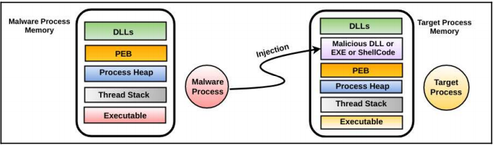

The image above shows this process in a clear way. Let's not forget that the malware is running in user space!

We have made a generalization about Process Injection, but this main topic includes different techniques in its sub-branches. Now we will go into the details of Process Injection techniques and explain the most well-known and effective techniques.

## 1. Remote DLL Injection
Before moving on to the Remote DLL Injection method, it is useful to give a brief information about DLL. DLLs, which stands for Dynamic Linking Library, is a code/data library. It is designed for many applications to use in a common way. Using DLLs provides benefits such as more performance and less memory usage.

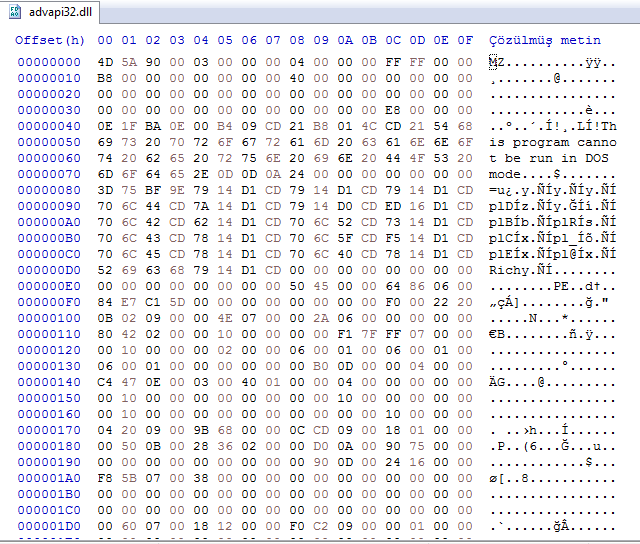

As can be seen in the image above, although it has MZ and PE headers, it has the characteristics of an executable, but it cannot run alone. Now that we have briefly mentioned DLL, we can move on to Remote DLL Injection.

Remote DLL Injection method has been used frequently in the past and today. The malware writes the path of the malicious DLL to the virtual memory of a legal process and creates a remote thread in the legal process to load this malicious DLL.

First of all, the malware needs to do Process32First, Process32Next and CreateToolhelp32Snapshot with the **Process Walking ** operations I just mentioned and determine the process to be injected.

Then, it gets the handle of the target process it detects using the OpenProcess API. If we explain the definition of handle by quoting from Windows' MSDN documentation;

> A handle is a reference to an object. In order for a process to access an object (file, registry, mutex, etc.), it must open a handle. For example, let's imagine that a process wants to write to a file. The process first calls the required API (WriteFile). Then it passes the handle to the WriteFile API and uses the handle (also called a recognizer) to write to the file.

After receiving the handle of the process, the malware then allocates memory with the **VirtualAllocEx** API. It then writes the path of the malicious DLL to the allocated memory location with the **WriteProcessMemory** API.

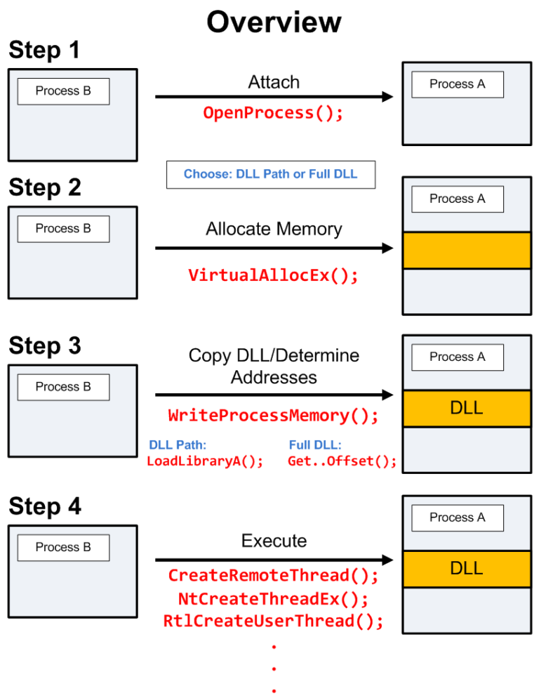

Afterwards, the malicious DLL, whose path is written to the location in memory, needs to be executed by threads. For this, the malware calls APIs like **CreateRemoteThread**, NtCreateThreadEx, RtlCreateUserThread. And inside these APIs it inserts the LoadLibrary API, which is used to load DLLs. Inside the LoadLibrary API, it places the location of the malicious DLL. After these operations, the pseudo code of Remote DLL Injection is as follows:

`CreateRemoteThread(LoadLibrary(C:\Program Files\malicious.dll))`

The CreateRemoteThread API is now monitored by many security products. A smart malware developer will not use this API. In the image below, you can see a static code analysis of the Rebhip worm that uses this method.

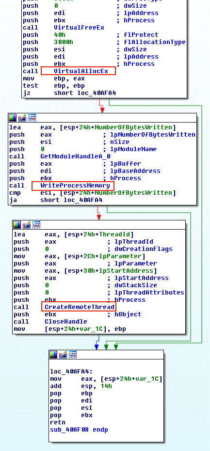

After a sample Remote DLL Injection, we can achieve our goal:

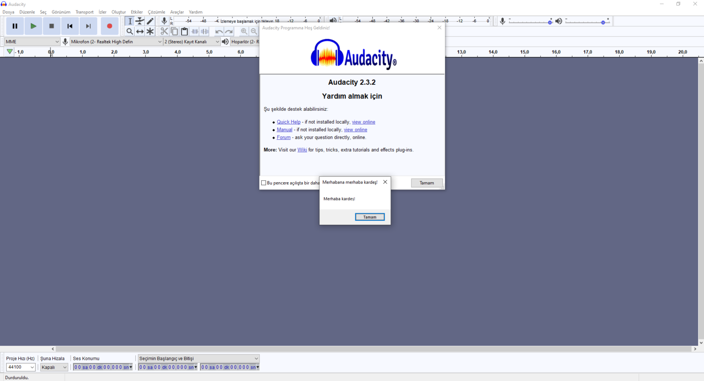

## 2. APC DLL Injection

After the Remote DLL Injection technique with the CreateRemoteThread() API, we will now see the APC DLL Injection technique.

This technique is similar to the Remote DLL Injection technique. But the point of difference is that it uses Windows' APC (Asynchronous Procedure Call) instead of the CreateRemoteThread() API in the DLL injection process. Here is a short definition of APC;

> APC is a function that executes asynchronously in the context of a specific thread. Each thread contains an APC sequence to be executed when the target thread enters an excitable state.

So to summarize, APC is a unit of work designed to make threads use less memory during wait time. Suppose a program runs with more than one thread. Usually threads run concurrently with each other. However, if some data is not ready (for example, if the program is waiting for input or confirmation from the user), it would not make sense to keep the thread in memory in a wait state, since the thread allocates a significant amount of memory in the thread stack and this memory cannot be used until confirmation is received.

The thread stack is therefore created as an object that takes up less memory. And this object is passed to the service that receives user input. When a response is received from the user, the service puts it into the object and passes the object to the execute unit.

The execute service consists of one or more threads and a task queue. Each running thread executes when it receives a task. When there is no task, the thread waits and thus memory is not used.

Now that we have briefly defined APC, we can move on to the APC DLL Injection technique.

We have just talked about the thread becoming alterable. A thread can become alterable when it calls one of the following APIs:

- SleepEx();
- SignalObjectAndWait();
- MsgWaitForMultipleObjectsEx();
- WairForMultipleObjectsEx();
- WaitForSingleObjectEx();

The main purpose of the APC DLL Injection technique starts with the malware identifying the thread in the target process that is alterable or likely to become alterable. It then places the malicious custom code into the thread's APC queue using the QueueUserAPC() API. The thread then executes the queued malicious custom code on its turn.

### Örnekleyelim

#### Let's illustrate

We have explained the technique, now let's take a short example. We will take a look at the injection of the malicious DLL into the legal iexplore.exe application with the APC DLL Injection method.

This technique follows the same 4 steps as in Remote DLL Injection. That is, it opens a handle, allocates space in the memory of the target process, copies the path of the malicious DLL into the allocated memory and sets the address of the LoadLibrary() API. It then follows these steps to force the target thread to load the malicious DLL:

1. Open a handle to the thread of the target process with the OpenThread() API. One of its parameters is the ID of the thread of the iexplore.exe process.

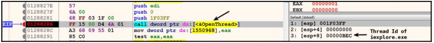

The return value of the OpenThread() API is the handle of the iexplore.exe thread.

2. The malware process calls the QueueUserAPC() API to queue the APC function in the APC queue of the Internet Explorer thread.

The first parameter is a pointer to the APC function that the malware wants to execute in the target thread. That is, the APC function address is the LoadLibrary() API itself. The second parameter is the handle of the target thread of the target process. The third parameter is the address of the full path of the malicious DLL in the target process's memory. When the thread executes, this address is passed as a parameter to the LoadLibrary() API and the malicious DLL is executed.

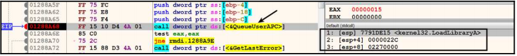

Parameter 3 is the process memory address of the iexplore.exe process.

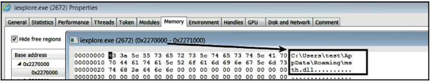

When we look at the address, we see the full path to the malicious DLL.

## 3. Process Hollowing
Process Hollowing, another code injection technique, aims to inject a malicious executable into the memory of a legal process.

The Process Hollowing technique provides many advantages to the attacker. Most importantly, it allows it to go undetected by security and forensic analysis tools. For example, if we talk about a malware with Process Hollowing technique to iexplore.exe, which is a legal process, the path of the process will point to iexplore.exe, which is a legal process. But iexplore.exe's memory contains the malicious executable.

Hollowing is often referred to as "hooking". The malware that will perform the Process Hollowing technique first starts the legal process in a suspended state.

The executable section of the legal process that starts in suspend state is loaded into memory. **PEB** (Process Environment Block) structure contains the full path of the legal process loaded into memory. The ImageBaseAddress part of the PEB holds the address of the executable section of the legal process in memory.

In the image below, we see the svchost.exe process started by the malware in suspend state. The svchost.exe process is loaded at address **0x01000000** in memory.

The malware then determines the address of the PEB structure in memory to access PEB.ImageBaseAddress. When it accesses ImageBaseAddress, it obtains the base address of the legal process in memory.

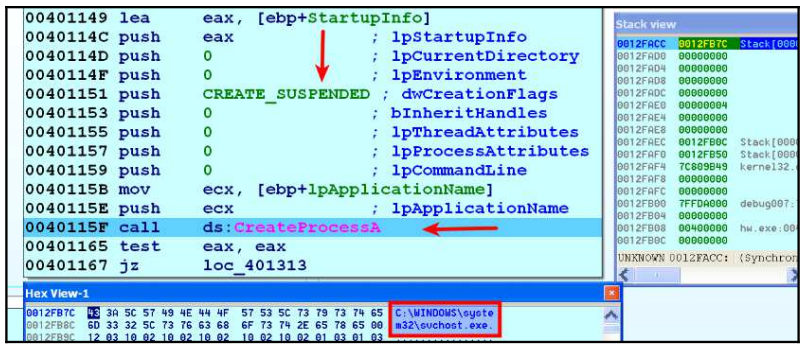

After detection of PEB, the malware calls the **GetThreadContext**() API. GetThreadContext() API gets the context of the specified thread. And it takes two parameters. The first one is the handle of the thread. The second parameter is a pointer to the structure called CONTEXT.

The malware passes the handle of the suspended thread to the first parameter and the pointer to the CONTEXT structure to the second parameter. After the API call, the CONTEXT structure is filled with the context (resource) of the suspended thread.

This CONTEXT structure now contains the suspended register states. The malware then reads the CONTEXT._EBX field, which contains a pointer to the PEB structure. Once the PEB address has been determined, we said that it reads the ImageBaseAddress. The purpose of this is to determine the base address of the legal executable.

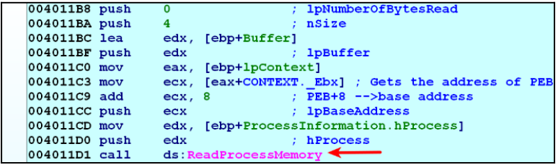

The image above shows the process memory being read.

It is worth mentioning that another method to detect the PEB pointer is the NtQueryInformationProcess API. After determining the base address of the target legal process, the malware deallocates the executable section of the legal process from memory. It does this with the NtUnMapViewofSection() API.

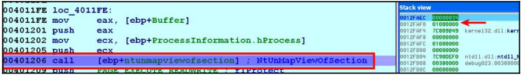

In the image above, you can see that the first parameter is the handle of the legal process svchost.exe and the second parameter is the base address of the legal process. After this operation, the executable section of the legal process is unallocated from memory, i.e. unmap. In the deallocated section, a new section with RWX permissions is allocated.

The new memory address can be allocated at the same address as the previous process or at a different address. In the image above, it is seen that VirtualAllocEx() API is called to allocate **0x00400000** in memory.

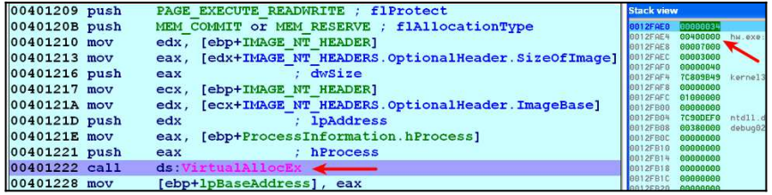

In the image above, you can see the memory space allocated at 0x00400000.

The malware, which allocates space with **RWX** permissions from the desired location in memory, uses the **WriteProcessMemory** API() to copy the executable file and its sections to the allocated location at address 0x00400000. This can be seen in the image below.

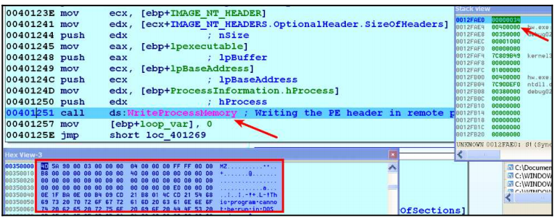

After this, the malware writes the address 0x00400000 to the PEB.ImageBaseAddress of the legal process, which is now filled with malicious content.

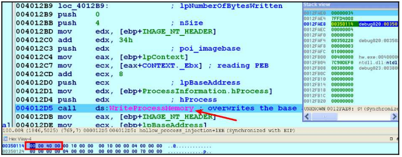

In the image above, we see that the value written in the PEB.ImageBaseAdress section of the legal process has changed from 0x01000000 to 0x00400000, which now contains the malicious executable. In short, the malware replaces the start address of the suspended legal process with the start address of the malware injected into the executable part of the legal process in memory.

After this process, the thread of the suspended process now points to the malicious part. Now all the attacker needs to do is to watch the suspended thread execute the injected code (or executable) by using the **ResumeThread() **API to resume from the suspended state.

The malware can also use the **NtMapViewSection**() API to avoid the VirtualAllocEx() and WriteProcessMemory() techniques to inject the malicious executable into the target process. This API is one of the APIs used in the Process Hollowing technique.

## 4. Process Doppelgänging

Process Doppelgänging, one of the popular Code Injection techniques, was first described in 2017 by 2 security researchers at enSilo in BlackHat.

Process Doppelgänging is of great importance as it works successfully on all Windows versions, including Windows 10. While it is similar to Process Hollowing, it differs from Process Hollowing in certain ways.

Process Doppelgänging was frequently used by malware when it first appeared, as it was difficult to detect by many AV products.

#### Point of Distinction?

Process Hollowing first starts the target process, then unmaps it and injects the malicious code. Process Doppelgänging overwrites the malicious code on the image before the process starts. This technique is the most important point of difference.

Process Doppelgänging uses Windows NTFS processes. It is a technique based on the operations of the TFS file (create, delete, modify). Transactional NTFS, aka TxF, integrates processes into the NTFS file system. Process Doppelgänging uses these specific features to hide malicious code or software. Let's imagine that a process creates a file at runtime and writes to it. Due to the nature of Windows, the file will not appear on disk until the process finishes its operation on the file or closes it. This is one of the advantages of Process Doppelgänging.

There are **4 steps** in NTFS operations for Process Doppelgänging. We can list and explain them as follows:

**Transact**:
In this step, the legal process is processed and the malicious application is overwritten. This process has sub-stages:

First, a new transaction is created using the CreateTransaction() API.
With the CreateFileTransacted() API, a handle is obtained. This handle can be used for all necessary file operations.
The legal file is overwritten with malicious content using the WriteFile() API.

**Load**:
In this stage, a memory section is created from the file modified by overwriting in Stage 1. With the NtCreateSection() API, a section is created from the modified file. This section will point to the malicious file.

**Rollback**:
At this stage, all changes are undone. Leaves the original file on disk. This is done with the RollbackTransaction() API.

**Execution**:
This part will explain how Process Doppelgänging is an evasive, pseudorecursive technique. From the first stage, there is a legacy command from Windows XP that can execute a previously opened process.

- First, processes and threads are created using the **NtCreateProcessEx**() and **NtCreateThreadEx**() APIs.
- Process parameters are created with the **RtlCreateProcessParameters**() API.
- Free space is allocated using the **VirtualAllocEx**() API and previously used parameters.
- Then a separate process is started using the **NtResumeThread**() API.

As a result, the process can start in an injected state even after the file content has been retrieved. This is why many AV products will appear to have no problems.

For example, when **mimikatz** was started normally, AV systems were able to detect it immediately. But when it was injected into a legal process using the Process Doppelgänging technique, AV systems failed to detect it.

In summary, what we need to do is to give the full path of the malicious content, while there is the Zw/NtCreateProcessEx() API that takes a section with PE content as a parameter after the rollback. By using this API, it is as if we are injecting without a file and the operating system cannot detect it because it will only notice the changes when the file is closed.

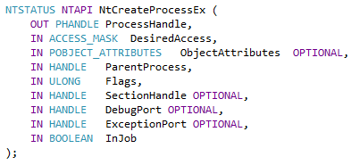

In the image above you can see the structure of the **NtCreateProcessEx**() API.

This technique is not completely hidden, and detection can be done using snapshot methods and comparisons. As a result, it can trigger AV systems because it creates a remote thread.

As a 2017 technique, we can say that today's AV systems can detect this technique.

## 5. Atom Bombing Injection

After the Process Doppelgänging code injection technique, we come to the Atom Bombing Injection technique. The Atom Bombing technique was invented by security researchers at enSilo, whose name you may recognize from the previous Process Doppelgänging technique.

The Atom Bombing technique works on all versions of Windows. It is not a bug or a vulnerability, but rather a technique that is inherent to Windows. Therefore, there is no patch available.

After its emergence, it can now be detected by AV products. This technique emerged in 2018.

Atom Bombing is named after the atomic tables of Windows. Atom tables perform operations such as sharing/exchanging data between processes using shared system memory. Windows defines atom tables as follows:

> "The atom table is a system-defined table that stores strings and their corresponding identifiers. An application places a string in the atom table and takes a 16-bit integer to access that string. This string placed in the atom table is called an atom."

Based on this explanation, we can more or less imagine the plan behind this technique. Instead of a legal string, the malware process creates the malicious code as an atom and allows the target legal process to load and run this malicious atom.

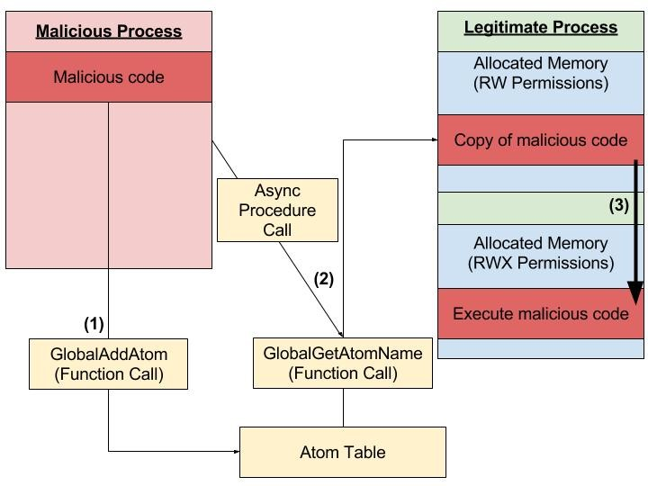

The image above shows the working structure of the Atom Bombing technique. To understand how the Atom Bombing technique works, let's explain it technically:

Malware (malicious process) places the malicious code in the atom table in string format with GlobalAddAtom(). The atom table is accessible by every process running on the system.

Using **APC** (Asynchronous Procedure Call), **GlobalGetAtomName**() copies the malicious code from the atom table to the legal process's memory space. Since APC is used, this technique can be done by any thread of an alterable process.

It then forces the system to allocate a new executable memory. After memory allocation, it copies the malicious code to the allocated memory space and executes it.

We have explained the technical details in the steps above. There are some important things about this technique.

Atom Bombing does not provide a Privilege Escalation. It bypasses by targeting processes that are whitelisted by AV products.

It allows access to the private data of the process. In other words, when you target a specific process (such as Web Browser), you can change the web content, access the passwords in the browser. You can take screenshots. It all depends on which process you target, but it gives the attacker a wide range of possibilities.

To give a real example, the Dridex banking trojan started using Atom Bombing after this technique was discovered. Guess why 🙂 🙂

Let's remember again that the Atomic Bombing technique uses the APC. There is very little information about APC. But as an example, it is used by malware to execute malicious code in the thread of another process that is running normally.

I have told you about the most popular, interesting and useful Process Injection techniques. Now we know that svchost.exe is a legal system application and is also frequented by malware 🙂

See you in another technical article...

## References

[1] https://www.elastic.co/blog/ten-process-injection-techniques-technical-survey-common-and-trending-process

[2] https://www.deepinstinct.com/2019/09/15/malware-evasion-techniques-part-1-process-injection-and-manipulation

[3] https://kaganisildak.com/2019/02/10/process-doppelganging/
