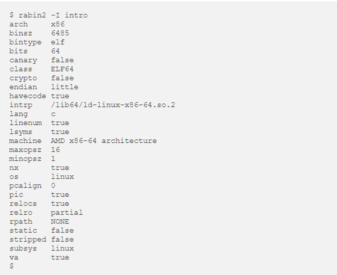
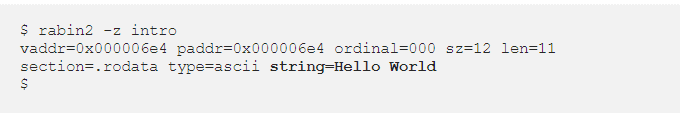
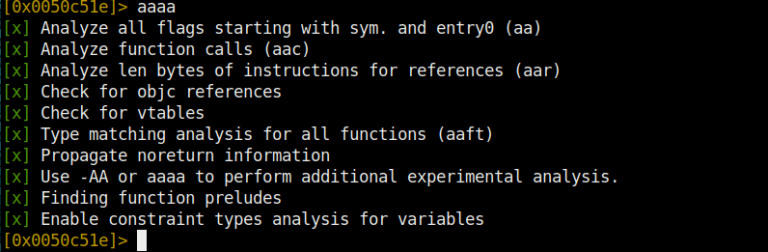
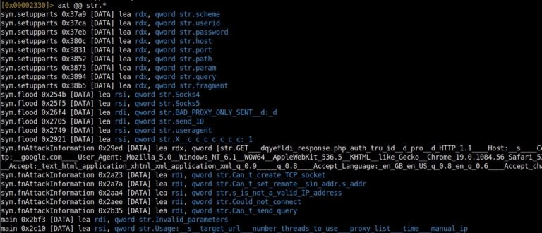
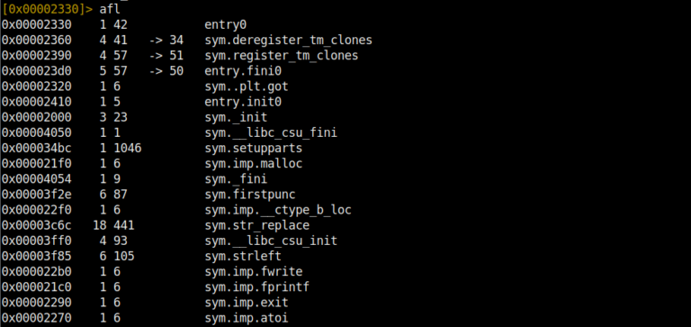
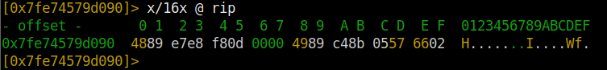
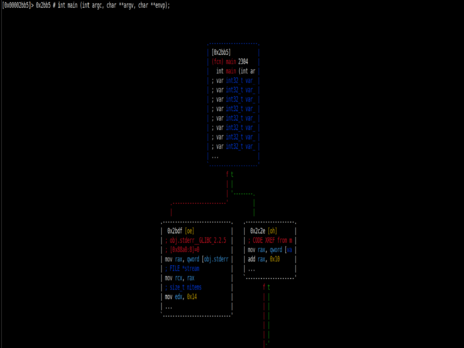
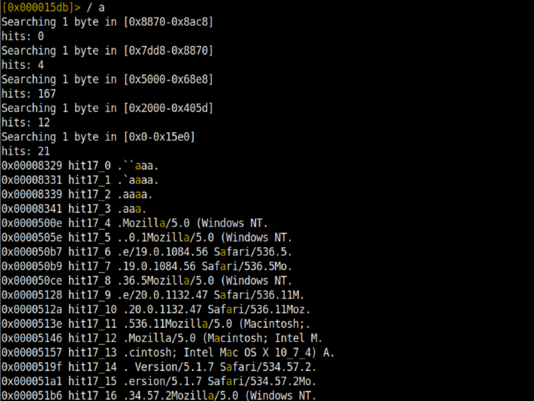

Greetings to everyone, friends. In this technical article, I will give you a short but useful introduction of Radare2, which you have heard of frequently, and which you can keep as a note in your hand.

#### What is Radare2?

Radare2 is both a disassembler and a debugger. We can define it as a tool that is 2-3 times more capable than IDA and Ollydbg combined. If you define yourself as a Reverse Engineer, it is a tool that I think you should know even at a basic level. Once you get used to it, it is the kind of tool that can make you a very good analyst or Reverse Engineer. There are versions for Linux and Windows, but you may not enjoy it because of the primitive terminal of Windows. That's why I personally use it on Linux.

#### How is it different from others?
- Open-source and free,
- It has a very functional structure,
- The usefulness of auxiliary tools,
- Although it runs in the terminal, it has a graphical interface that makes it easy to use.
- Useful features under one roof!
- Data analysis, binary patching, comparing data, replacing, visualization and much more.
- Supports many architectures and file formats.
- So far, there is hardly any file that cannot be opened or debugged with Radare2.

### Rabin2

Rabin2 is a companion tool of Radare2. It provides information from binary. It extracts a lot of useful information from the binary such as strings, compile time, the language the program is written in and gives us preliminary information before we even start the analysis.

Also, instead of looking for strings one by one, after disassembling them, we can use Rabin2 to reveal them.

The `-z` parameter gives us the strings in the data segment. If we want to dump the strings in the whole binary, we should use the `-zz` parameter.

Elf can interpret PE, Mach-O, Mach-O, Java Classes and many more.

#### Let's get started!

Radare2 has two usages, `radare2 file.exe` and `r2 file.exe`.
After issuing our command, we need to analyze the binary.

With the `aa` command (analyse all) you can analyze the whole binary. For more detailed analysis we can use the `aaa` command. With the analyze operation, we can find strings in the binary, functions and many other important
we are revealing information.
And with `aaaa` we are analyzing at the highest level.

Our biggest help when using Radare2 will of course be the internal documentation or help commands.  You can access all help documents with the `?` command.

#### Seek (Jump) Commands

With `seek` command we can go to a specific address in memory. In short, it is our jump command.

For example, we can jump to the main function with the `s main` command if the name is not changed. Or we can jump to address 0x581236 with `s 0x581236`. We can also just use `s` to print the current address on the screen.

With the `s- ` command we can go to the previous address. With the `s- n command n address undo

we can do. The effects of `s--` and `s++` are also below.

#### Flagler

After analysis, Radare2 associates the outputs with some offsets. These are

- Strings
- Symbols
- Sections
- Relocs
- Imports
- It can be sorted as functions.

And these are generally called **flags**. Flags are one of the points that will help us the most in analysis. Which functions are used and imports are very useful especially in Malware Analysis.

The `fs` command is used to display the list of existing flags.

To display the contents of a flag, the `fs <flag name>; f` command is used.

#### Analysis and Strings

So far we have been displaying strings with the Rabin2 utility, but how do we display them during analysis? The `iz` command will display only the strings in the data segment.

`izz` will display all strings in the binary. These usages are similar to Rabin2's `-z` and `-zz` parameters.

The only difference is that we use one before analyzing the program and the other while analyzing the program. In general, in a C program, if a string is printed to the screen with printf or any output function, it is associated with the **str.** tag and Radare2 interprets it as such. It tells us that it is a string. If we just want to print all strings with the str. tag, we can use the `axt @@ str.*` command. This command will give us what we want.

We have used this command, but what do the commands we enter here do? The `axt` command means **'find the code/data in the given reference**'. The **@@** signs are like the foreach iterator function we know from PHP. It is used to run a command on the offset list over and over again. str. stands for string flags. All this combination gives us a list of not only the strings used, but also the names used and the commands referenced.

#### Function List

To view the imported functions in the target program we are analyzing, we will use the `afl` command. This command, which stands for **Analyze Functions List**, gives us critical information.

To see the assembly code of the program we need to enter the disassemble command. If we are inside a function, we can disassemble the function by entering the `pdf` **(print disassemble functions)** command. If the address we are in is not a function, we can access the assembly code by entering `pd` **(printf disassemble functions)**.

#### Registers

First of all, we use the `dr` command to see which registers we have. If we want to print the contents of the registers on the screen, we can use `pxr @ <register name>` or `pxr @ <register address>`. There are also some special usages.

With the `x/16x @ rip` command, we specify how much area of the rip register will be displayed and print it on the screen. If we want to show more data, we should increase the size of 16x even more.

With the `dr ebx = 0x01` command, we can set the register to the value we want.

#### Görsel Modu Kullanma

Farklı varyasyonları bulunmaktadır (V). Fakat bizim kullanacağımız ve en işlevli varyasyonu olan vv modunu kullanacağız.

`VV` komutunu girererek konsol ekranı üzerinden görsel arayüze ulaşabilirsiniz. Görsel modun da kendi içinde farklı modları bulunmaktadır. **P** tuşuna basarak farklı modlara geçiş yapabilirsiniz. Ayrıca Mouse’u kullanabilirsiniz. Menülere Mouse ile tıklayabilir ve ok tuşları, enter ile seçiminizi yapabilirsiniz. Görsel modda bir çok özellik bulunmaktadır.

**k** ve **j** tuşlarıyla da aşağı yukarı şekilde kodların içinde gezinebilirsiniz. Enter ile de odaklandığınız sekmeyi tam ekran yapabilirsiniz. Ayrıca `vv` komutu ile sekmeli görünüme geçiş yapabilirsiniz. `:` komutu ile görsel modda iken Radare2 komutlarını kullanabilirsiniz. Örneğin `: s main` şeklinde kullanımı mevcuttur. 

`;` komutu ile bulunduğunuz satıra yorum ekleyebilir veya var olan yorumu silebilirsiniz. 
`;` bu komut ile yorum ekleyebilirsiniz. `; -` bu komut ile yorumu silebilirsiniz.

**+** ve **–** tuşlarına basarak zoom in veya zoom out yapabilirsiniz. Bu aynı zamanda IDA’daki graph view özelliğini kazandırmaktadır.

**q** tuşu ile de Graph Mode’dan çıkış yapıp konsol moduna geri dönebilirsiniz.

#### Binary Patching

One of the most important features of Radare2 is that we have the option to interfere with the code as we want. So we can patch the code. We all know that we need to bypass anti-vm and other measures in malware analysis. For this, it would be wise to use Radare2's patch feature.

**Let's get started!

First of all, we need to start Radare2 in write mode and properties.

For this, `r2 -w file.exe` command is used.

As always, we analyze the binary first. We complete the analysis with a sufficient level of `aaaa`. To patch our program, we use the `vvv` command in tabbed view mode.

Now we have switched to Visual Mode and we can navigate with the arrow keys. To change the command of the active line, press the big '**A**' key. And type the assembly code we want and press Enter. Now the code we typed is visible on the corresponding line.

Then we exit by pressing the **q** key without saving anything. And our changes are automatically saved.

#### Binary Search

One of the best features of Radare2 is that we can search in assembly code. We have the option to search in many ways. Using the `?` command you can access all the commands and therefore the search commands.

The `/ fatih` command will search for the string '**fatih**' in the code and return the results with their addresses.

The `/x! 52` command will display the results in binary with **52** in hex.

` /a jmp eax` will disassemble the code and then find **jmp eax** and return it with its address.

will print it on the screen.

The `/x 1234` command will search for **1234** in hex strings and print its address on the screen.

 The `/ca` command will find **AES** keys in memory if they exist.

 The `/cr` command will find **RSA Private Keys** in memory if they exist.

#### Radare2 and Debugging

Now we come to one of the most important features of Radare2. We said that it supports many architectures and file types. Therefore, we can debug most file types from PE files to Mach-O files.

This feature is very useful for Dynamic Analysis in Malware Analysis. Before starting the debug process, we need to start Radare2 in debug mode.

We have started our program in debug mode as `r2 -d file.exe`.We can enter arguments to our program with the command `r2 -d file.exe <arg1> <arg2>`. Of course if our program takes arguments :)

You can access the debugger commands with the `d?` command.

With `db 0x25466d` command we can set a breakpoint at the specified address.

With `db` command we can see the existing breakpoints.

With `db- 0x25466d` command we can delete the specified breakpoint.

With `db-*` command we can remove all existing breakpoints.

`dbd 0x25566d`

We can disable the existing breakpoint without removing it

`dbe 0x25566d`

We can enable the breakpoint, which is disabled.

`dc` executes the program directly. **(Continue execution)**

`dcc` runs the program until call. **(Continue Until Call)**

`dcr` runs the program until return. **(Continue Until Return)**

`dcu main` runs the program up to **main**.

`dcu 0x256674d` runs the program up to the specified address.

`ds` steps into functions (if it can be entered) once (Step Into)

The `ds 10` program executes 10 more instructions by going inside the function.

`dso` advances once without entering into functions.

The `dso 10` program executes 10 more instructions without entering a function.

`ood` **restarts** our program in debug mode.

#### Radare2 Memory

The memory part of Radare2 also has many useful functions.

`dm` shows us the memory map.

`dm=` prints the memory map on the screen in ascii arrow bars.

`dm.` displays the memory map name and address of the current address.

`dm- 0x25884689` deallocates the memory map at the specified address.

`dms` displays memory snapshots.

`dms <address>` takes a memory snapshot of the given address.

`dms-<id>` deletes the memory snapshot whose ID is given.

`dmsA <id>` applies the memory snapshot whose ID is given.

**Now let's try to take a dump of a map in memory...**

#### Why is such a thing needed?

Especially when doing Malware Analysis, you may have witnessed that Malware runs critical applications in different parts of the memory than their own areas. 

In order to obtain important information, we need to dump that running program from Memory so that we can achieve our goal. We can do this in Radare2 in a very simple way.

First we take a snapshot of the specified address `dms 0x751236548625f251`. Then, with the `dmst virus.dmp 0x00007fe665484000` command, we first give the file name we want to save to disk and then the address of the memory map from which we took the snapshot. Then we see that our virus.dmp file is created at the same address as our program.

AND THE END! I have given you ready-made information that you can use in a practical way... Now the rest is up to you...

**Lots of analysis and reverses :D**
