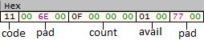

The more functional and developable a product is, the more complex it is. This complexity made it difficult to create "quality" applications in the software development world where functional programming was previously used effectively. Instead of functional programming, the object-oriented programming paradigm, which was introduced with a **higher level** approach, was introduced and enabled developers to reveal large projects more clearly by writing code that can be associated with real life.

> The advantages of object-oriented programming for the programmer are indisputable, but do the same conditions apply to the reverse engineer analyzing an application?

The answer to the question is clearly **no** because while software coded with a classical (i.e. functional) approach is compiled by the compiler as is, software coded using OOP structure is compiled by the compiler using different approaches and rules. A reverse engineer who is not familiar with these approaches and rules has difficulty in analyzing such applications. Especially if advanced OOP features such as polymorphism and dynamic binding are utilized, this situation becomes unmanageable. In this article, I will talk about the topics and details of how to reversing C++ applications written using OOP. Since defining C++ structures in sophisticated and advanced applications and shortening the reverse engineering processes will not fit in one article, I will make this a series :)

## Class & Struct Similarity

We mentioned that OOP provides great benefits and can simplify complex structures. There is an unknown here, isn't there? If you have analyzed applications developed with traditional programming (ex: a malware written in C) and you are familiar with the x86 architecture and instruction set, it is not so unknown for you. Because the "high-level" concepts we are going to talk about are actually based on the basics you already know.

```cpp
// class_struct.h

class cls_material{
public:
    char code;
    int count;
    bool avail;
};

struct str_material {
    char code;
    int count;
    bool avail;
};
```

The **class** and **struct** we defined above are basically the same. The compiler interprets and compiles both in the same way. Let's make implementations to test this.

```cpp
// class_struct.cpp

    struct str_material gold;
    cls_material copper;

    gold.avail = true;
    gold.code = 17;
    gold.count = 15;

    copper.avail = false;
    copper.code = 18;
    copper.count = 23;
```

In the small code example we kept data about the materials. An important point here is that the resources are initialized on the stack (we will also talk about dynamic initialization). There doesn't seem to be any difference at the source code level. Let's dissassemble and take a look.

```nasm
.text:00401000                 push    ebp
.text:00401001                 mov     ebp, esp
.text:00401003                 sub     esp, 18h ; allocated for local variables
.text:00401006                 mov     [ebp+var_4], 1 ; gold.avail
.text:0040100A                 mov     [ebp+var_C], 11h ; gold.code
.text:0040100E                 mov     [ebp+var_8], 0Fh ; gold.count
.text:00401015                 mov     [ebp+var_10], 0 ; copper.avail
.text:00401019                 mov     [ebp+var_18], 12h ; copper.code
.text:0040101D                 mov     [ebp+var_14], 17h ; copper.count
.text:00401024                 xor     eax, eax
.text:00401026                 mov     esp, ebp
.text:00401028                 pop     ebp
.text:00401029                 retn
.text:00401029 _main           endp         endp
```

We have proved that there is no difference at the assembly level, and that struct and class are the same up to the memory footprint. In the simplest terms, we can say that classes are essentially the same as structs and that these two structures are really just a collection of memory addresses of types.

## Class Constructor

Constructor is one of the most important concepts we need to recognize in order to reverse the OOP structure in C++.  Let's look at the **declaration** and **definition** of the constructor.

```cpp
// constructor.hpp

class Material {

private:
    char code;
    int count;
    bool avail;

public:
    Material(char _code, int _count, bool _avail) : code{ _code }, count{ _count }, avail{ _avail }{}

    char getCode();
    int getCount();
    bool isAvail();

};

// constructor.cpp

char Material::getCode() {
    return code;
}

int Material::getCount() {
    return count;
}

bool Material::isAvail() {
    return avail;
}

// main.cpp (Implementation)

int main() {
    Material* gold = new Material(17, 15, true);
    std::cout << gold->getCode() << "\n" << gold->getCount() << "\n" << gold->isAvail();

    return 0;
}
```

The constructor of our Material class takes the attributes at initialization time and makes the variables ready for use. There are also related member functions that return each attribute. In its implementation, it is worth noting that we use **dynamic initialization** compared to the previous simple class example.

```nasm
.text:004012E3                 push    0Ch             ; Class boyutu
.text:004012E5                 call    ??2@YAPAXI@Z    ; operator new(uint)
.text:004012EA                 mov     [ebp+Block], eax
.text:004012ED                 sub     esp, 8
.text:004012F0                 mov     [ebp+var_4], 0
.text:004012F7                 mov     ecx, eax ; eax = Class pointerı
.text:004012F9                 call    sub_401260 ; Material::Material()
```

Before calling the constructor, the heap allocated memory area that will hold our class pointer is assigned to the `ecx` register and the constructor of the Material class (`sub_401260`), which is basically a member function, is called.

```nasm
.text:00401260                 push    ebp
.text:00401261                 mov     ebp, esp
.text:00401270                 push    esi
.text:00401271                 mov     esi, ecx ; ecx = this pointer
.text:00401273                 push    0Ah
.text:00401275                 mov     byte ptr [esi], 11h ; code 
.text:00401278                 mov     dword ptr [esi+4], 0Fh ; count
.text:0040127F                 mov     byte ptr [esi+8], 1 ; avail
.text:0040129B                 mov     eax, esi ; this pointer moved to eax register for return
.text:004012A5                 mov     esp, ebp
.text:004012A7                 pop     ebp
.text:004012A8                 retn    0Ch
```

We can see that the `sub_401260` function is a constructor. The `this` pointer, which is the secret pointer of our object, is used in the constructor through the `ecx` register. The parameters we pass in the initialize phase are moved to the memory space allocated for our object according to their size.



After the object is constructed, the arrangement of the attributes in memory is as above (I don't mention the memory padding and the size of the variables).

## Member Function Calls

Let's continue our example with our **Material** class again. Since the attributes are specified as private, we have written **get** functions (you can see their definitions in the example above).

```nasm
.text:00401299                 call    sub_401260 ; constructor
.text:0040129E                 mov     edx, eax ; edx = object pointer
.text:004012A0                 mov     ecx, edx ; ecx = object pointer
.text:004012A2                 call    sub_401250 ; Material::isAvail()
.text:004012A7                 movzx   ecx, al
.text:004012AA                 push    ecx
.text:004012AB                 mov     ecx, edx ; ecx = object pointer
.text:004012AD                 call    sub_401240 ; Material::getCount()
.text:004012B2                 push    eax 
.text:004012B3                 call    sub_401230 ; Material::getCode()
```

We can call our member functions via our object pointer (`this`). Note that C++ compilers (at least **MSVC**) assign the `this` pointer to the `ecx` register when calling a member function of an object. So the constant use of **ecx** may indicate the use of **OOP** primitives.

## Inheritance

Inheritance is undoubtedly the concept that gives the OOP structure its inter-class relationship and extension structure.  It is one of the two most difficult (in my opinion) fundamentals to reverse OOP based C++ applications. 

It would be more useful to examine the topic of Inheritance under two headings as **single** and **multiple**. Let's both explain and reverse with examples :)

### Single Inheritance

In this situation derived class has only one base class.

```cpp
// inheritance.hpp

class Plant {
private:
    int age;
public:
    Plant() : age{ 0 } {};
};

class Tree : public Plant {
private:
    int leaf_count;
public:
    Tree() : leaf_count{ 0 } {}
};

class Fruit : public Plant {
private:
    int water_percent;
public:
    Fruit() : water_percent{ 0 } {};
};
```

There are two important concepts when it comes to inheritance: **base class** and **derived class.** Derived classes take the attributes of base classes. Since we know that each plant has an age, we define this common attribute in our base class. And we inherit our base class to each plant type we create.

```cpp
// main.cpp

int main() {
    Tree oak;
    Fruit apple;

    return 0;
}
```

As you can see in the implementation, we have inherited the attributes of the base class to the derived classes. Let's come to the reverse part, which is our topic, and this time let's consider that we are creating our objects on the **stack**.

```nasm
.text:004010D0                 push    ebp
.text:004010D1                 mov     ebp, esp
.text:004010D3                 and     esp, 0FFFFFFF8h
.text:004010D6                 sub     esp, 8 
.text:004010D9                 lea     ecx, [esp+8+var_8] 
.text:004010DC                 call    sub_401090 ; Tree::Tree()
.text:004010E1                 lea     ecx, [esp+8+var_8]
.text:004010E4                 call    sub_4010B0 ; Fruit::Fruit()
.text:004010E9                 xor     eax, eax
.text:004010EB                 mov     esp, ebp
.text:004010ED                 pop     ebp
.text:004010EE                 retn
```

On the surface it looks like the constructors of the derived classes are called first, but the underlying concept is completely different.

```nasm
.text:00401090 sub_401090      proc near               
.text:00401090                 push    esi             
.text:00401091                 mov     esi, ecx
.text:00401093                 call    sub_401070 ; Plant::Plant()
.text:00401098                 push    offset aTreeTree ; "Tree::Tree()\n"
.text:0040109D                 mov     dword ptr [esi+4], 0
.text:004010A4                 call    _printf
.text:004010A9                 add     esp, 4
.text:004010AC                 mov     eax, esi
.text:004010AE                 pop     esi
.text:004010AF                 retn
.text:004010AF sub_401090      endp


.text:004010B0 sub_4010B0      proc near               
.text:004010B0                 push    esi             
.text:004010B1                 mov     esi, ecx
.text:004010B3                 call    sub_401070 ; Plant::Plant()
.text:004010B8                 push    offset aFruitFruit ; "Fruit::Fruit()\n"
.text:004010BD                 mov     dword ptr [esi+4], 0
.text:004010C4                 call    _printf
.text:004010C9                 add     esp, 4
.text:004010CC                 mov     eax, esi
.text:004010CE                 pop     esi
.text:004010CF                 retn
.text:004010CF sub_4010B0      endp


.text:00401070 sub_401070      proc near               
.text:00401070                                         
.text:00401070                 push    esi             
.text:00401071                 mov     esi, ecx
.text:00401073                 push    offset Format   ; "Plant::Plant()\n"
.text:00401078                 mov     dword ptr [esi], 0 ; age = 0
.text:0040107E                 call    _printf
.text:00401083                 add     esp, 4
.text:00401086                 mov     eax, esi
.text:00401088                 pop     esi
.text:00401089                 retn
.text:00401089 sub_401070      endp
```

Now everything is clearer. Even though it looks like the constructors of the derived classes are called first, the compiler actually calls the base class constructor first. After the base class is constructed, the other elements in the derived class are constructed. Maybe it seems confusing, let's describe it in our code:

```cpp
Tree() : leaf_count{ 0 } {}
            |
            |
            v              
Tree() {
    Plant::Plant(); // you might think there is a secret call 
    leaf_count = 0;
}
```

### Multiple Inheritance

Derived class has more than one base class. Let's update our existing Tree class and add Forest as a base class.

```cpp
class Forest {
private:
    int numof_trees;
public:
    Forest() : numof_trees{ 0 } { printf("Forest::Forest()\n"); }
};

class Tree : public Plant, public Forest {
private:
    int leaf_count;
public:
    Tree() : leaf_count{ 0 } { printf("Tree::Tree()\n"); }
};
```

Currently we have a derived class with 2 base classes. Let's disassemble it and see which one will be constructed first.

```nasm
.text:00401090 sub_401090      proc near ; Tree::Tree() constructor             
.text:00401090                 push    esi             
.text:00401091                 mov     esi, ecx ; esi = this pointer
.text:00401093                 call    sub_401050 ; Plant::Plant()
.text:00401098                 lea     ecx, [esi+4]
.text:0040109B                 call    sub_401070 ; Forest::Forest()
.text:004010A0                 push    offset aTreeTree ; "Tree::Tree()\n"
.text:004010A5                 mov     dword ptr [esi+8], 0 ; leaf_count = 0
.text:004010AC                 call    _printf
.text:004010B1                 add     esp, 4
.text:004010B4                 mov     eax, esi
.text:004010B6                 pop     esi
.text:004010B7                 retn
.text:004010B7 sub_401090      endp
```

We can see that base classes are constructed from left to right, unlike parameter passing. Let's change the initialize values of the class variables to `leaf_count = 1, age = 2, numof_trees = 3`, add the attribute `int root_size = 50` to the Plant class and see how the object belonging to the **Tree** class is arranged in memory with multiple member variables.

```nasm
.text:00401070 sub_401070      proc near ; Plant::Plant()               
.text:00401070                                         
.text:00401070                 push    esi             
.text:00401071                 mov     esi, ecx ; esi = Tree this pointer 
.text:00401073                 push    offset Format   ; "Plant::Plant()\n"
.text:00401078                 mov     dword ptr [esi], 2 ; age = 2
.text:0040107E                 mov     dword ptr [esi+4], 32h ; root_size = 50
.text:00401085                 call    _printf
.text:0040108A                 add     esp, 4 
.text:0040108D                 mov     eax, esi ; return this 
.text:0040108F                 pop     esi
.text:00401090                 retn
.text:00401090 sub_401070      endp


.text:004010A0 sub_4010A0      proc near ; Forest::Forest()              
.text:004010A0                 push    esi            
.text:004010A1                 mov     esi, ecx ; Tree this pointer
.text:004010A3                 push    offset aForestForest ; "Forest::Forest()\n"
.text:004010A8                 mov     dword ptr [esi], 3 ; numof_trees = 3
.text:004010AE                 call    _printf
.text:004010B3                 add     esp, 4 
.text:004010B6                 mov     eax, esi ; return this
.text:004010B8                 pop     esi
.text:004010B9                 retn
.text:004010B9 sub_4010A0      endp
```


In Multiple inherit, we can see the content of the object created for the derived Tree class more clearly. As in Single, we have understood that it contains all the attributes of the base class in order from right to left.

## Polymorphism

Polymorphism, which stands for **Polymorphism**, basically allows us to behave *"of another type and in more than one form "*.  Polymorphism is most common for us reverse engineers with the concept of **dynamic dispatch**. **Virtual methods** are used to call the same function (type of function, number of parameters and types) of the **most derived class** that is derived and overridden from the base class and is one of the ways to provide dynamic dispatch. 

Let's continue with our **Tree** and **Plant** class examples, but this time simplify them a bit.

```cpp
// poly.hpp

class Plant {
private: 
    int age;
public:
    Plant() : age{ 20 } {}
    virtual void create() { std::cout << "New plant type created!\n"; }
    void del() {std::cout << "Plant type deleted!\n";
    }
};

class Tree : public Plant{
private:
    int leaf_count;
public:
    Tree() : leaf_count{ 10 } {}
    virtual void create() { std::cout << "New tree created!\n"; }
    void del() { std::cout << "Tree deleted!\n"; }
};
```

The **create()** and **del()** methods, which are exactly the same, can be found in both base and derived classes. In order to fully understand the function of virtual methods, let's be aware that our **del()** method is not a virtual method.

```cpp
// main.cpp

int main() {
    Tree* oak = new Tree;
    Plant* plt { oak };

    plt->create();
    plt->del();

    return 0;
}
```

```
output:

New tree created!
Plant type deleted!
```

When the virtual method is called from the base class, the method of the most derived class is called, while in the non-virtual method, it calls the method of the class (**Plant**) from which it is currently called without any lookup action on the objects. 

> So what exactly is this lookup and how does the compiler call the most derived method?

### Virtual Function Table (VfTable)

Virtual function invocation, also referred to as dynamic binding, takes place at runtime and is **as far as possible** independent of compiler optimizations. The **VfTable** contains the address of each virtual method in sequential order and is dispatchable by the table.

```nasm
.text:00401030 sub_401030      proc near ; Tree::Tree()
.text:00401030                 call    sub_401000 ; Plant::Plant()
.text:00401035                 mov     dword ptr [ecx], offset ??_7Tree@@6B@ ;&Tree::vftable
.text:0040103B                 mov     eax, ecx
.text:0040103D                 mov     dword ptr [ecx+8], 0Ah ; leaf_count = 10
.text:00401044                 retn
.text:00401044 sub_401030      endp


.text:00401000 sub_401000      proc near ; Plant::Plant()
.text:00401000                 mov     dword ptr [ecx], offset ??_7Plant@@6B@ ; &Plant::vftable
.text:00401006                 mov     eax, ecx
.text:00401008                 mov     dword ptr [ecx+4], 14h
.text:0040100F                 retn
.text:0040100F sub_401000      endp
```

Since it is a base class, the **Plant::vftable** reference will be assigned to the object pointer, but later the **Tree::vftable** reference will be replaced and the **Tree::create()** method will be called. Since we first create an object from the Tree class and reference it to the Plant class, the compiler changes the vftables. The reason why we specify **as independent of compiler optimization as possible** is also explained in practice.

```nasm
.rdata:00403204 ??_7Plant@@6B@  dd offset sub_401010    ; Plant::create()
.rdata:00403208                 dd offset ??_R4Tree@@6B@ ; const Tree::`RTTI Complete Object Locator'
.rdata:0040320C ; const Tree::`vftable'
.rdata:0040320C ??_7Tree@@6B@   dd offset sub_401050    ; Tree::create()
```

We can also understand the content of **VfTable** from the above disassemble output. For a better understanding, let's specify it via the **UML** template and show it in the memory array.


```nasm
plt: 0C 32 99 00 | 14 00 00 00 | 0A 00 00 00
      &vftable        age         leaf_count


&vftable(0099320C): 50 10 99 00
                   &Tree::create()  
```

We have clearly explained the vftable sharing and memory allocations between base and derived classes.

```nasm
.text:00401073                 call    sub_401030 ; Tree::Tree()
.text:00401078                 mov     ecx, eax ; eax = oak object pointer
.text:0040107A                 mov     edx, [eax] ; [eax] = vftable reference
.text:0040107C                 call    dword ptr [edx] ; [edx] = Tree::create() reference
.text:0040107E                 call    sub_401020 ; Plant::delete()
```

In the disassemble fragment above, we can see how vftable is used. In our implementation, we **override** and call the `Tree::create()` method. We can call the method at **runtime** via vftable, which is referenced in the first 4 bytes of the object pointer. Then, since the **virtual** keyword is not used, the `Plant::delete()` method is called and the program terminates.

## References

[Microsoft Word - Reversing_CPP.doc (blackhat.com)](https://www.blackhat.com/presentations/bh-dc-07/Sabanal_Yason/Paper/bh-dc-07-Sabanal_Yason-WP.pdf)

[Reversing C++ programs with IDA pro and Hex-rays – Aris' Blog (0xbadc0de.be)](https://blog.0xbadc0de.be/archives/67)

[Learn C++ – Skill up with our free tutorials (learncpp.com)](https://www.learncpp.com/)
