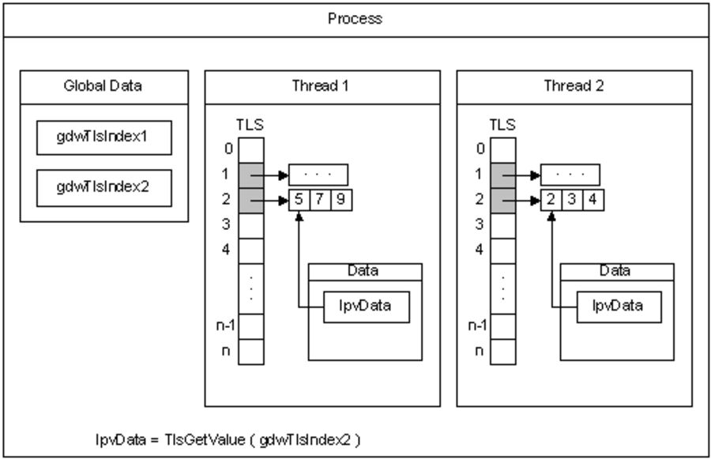
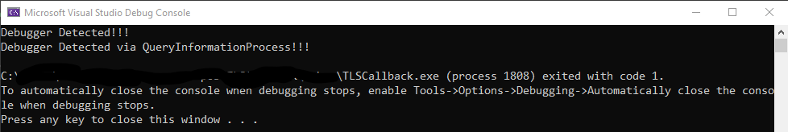

Even though malicious applications are offense-oriented, they often demonstrate defensive capabilities in order to sustain their offensive behavior longer and more effectively. In this cat-and-mouse game, one of the biggest goals of malicious actors is to try to prevent their malware from being analyzed as much as possible. Together with you, we will examine and realize a technique that we often hear about, which is outdated but can be considered the beginning of the cat-and-mouse game.

But before we get into the details and implementation of the technique, knowing what TLS is will give us a great advantage.

## What is TLS?

TLS, which stands for **Thread Local Storage**, is a method by which the threads (**thread**) of a process can store their unique data in memory. At runtime (**runtime**), thread-specific data can be supported by Windows APIs such as TlsAlloc, TlsGetvValue, TlsSetValue. It is also known that all threads of a process share the same virtual space. A local variable in a function is specific to the thread that executes it. However, static and global variables outside the function are shared by all threads of the process. The situation is slightly different for variables created in the TLS structure. In the TLS structure, threads have their own unique copies for variables.  In other words, in the TLS structure, the value of a variable that is changed only changes in the relevant thread. Since other threads have their own copies, there is no change.

With TLS, it is possible for the process to provide data specific to each thread by using a global index. The following image shows exactly how TLS works.

 

In the image above, you can see two threads using TLS. TLS creates 2 global data named gdwTlsIndex1 and gdwTlsIndex2. With the TlsGetValue API, the value corresponding to the relevant indexes of the threads is stored in the lpvData variable.

## Debug Detection with TLS Callback

Now that we have a little bit of a grasp of the TLS logic to understand the topic of this article, let's get back to the topic at hand. The old tradition (I say old because many modern debug detection methods have been developed.  We will take a look at how to detect debug with TLS Callback.

One of the biggest reasons why TLS Callback is popular is that it works before the **entrypoint**. This means that malicious actors can use TLS Callback at the beginning of the program to see if their malicious application is being debugged before the main purpose of their application is known. TLS Callback is an old anti-debug technique that can be easily bypassed today.

To better understand the TLS Callback anti-debug technique, let's implement it.

```cpp
#include <iostream>
#include <windows.h>
#pragma comment(lib, "ntdll.lib")
#pragma section(".CRT$XLB", read) //We created a new section called CRT$XLB. The name of the section must be the same.
#define NtCurrentProcess() (HANDLE)-1
extern "C" NTSTATUS NTAPI NtQueryInformationProcess(HANDLE hProcess, ULONG InfoClass, PVOID Buffer, ULONG Length, PULONG ReturnLength);
#ifdef _WIN64
#pragma comment(linker, "/INCLUDE:_tls_used")
#define readpeb (PBOOLEAN)__readgsdword(0x60) + 2 // Points to BeingDebugged in the PEB structure. for x64
#else
#pragma comment(linker, "/INCLUDE:__tls_used")
#define readpeb (PBOOLEAN)__readfsdword(0x30) + 2 // for x32 
#endif
void WINAPI DebuggerDetect(PVOID handle, DWORD Reason, PVOID Reserved) {
    PBOOLEAN BeingDebugged = readpeb;
    HANDLE DebugPort = NULL;
    if (*BeingDebugged) {
        printf("Debugger Detected!!!\n");
    }
    else {
        printf("No debugger detected!\n");
    }
    if (!NtQueryInformationProcess(NtCurrentProcess(), 7, &DebugPort, sizeof(HANDLE), NULL)) { 
        // If DebugPort is not 0, it indicates that the program is debugged.
        if (DebugPort) {
            printf("Debugger Detected via QueryInformationProcess!!!\n");
            exit(1);
        }
        else {
            printf("No debugger detected for QueryInformationProcess\n");
        }
    }
}
__declspec(allocate(".CRT$XLB")) PIMAGE_TLS_CALLBACK CallbackAddress[] = { DebuggerDetect, NULL };
int main() {
    printf("Hello, you're now in the entrypoint!");
    return 0;
}
```

Let's take a look at the anti-debug technique with the TLS Callback we implemented above. In our example where we add an anti-debug technique with the **NtQueryInformationProcess** API, we give instructions to our compiler with pragma keywords. You can already see commands such as include ntdll library, create a new section, link the specified ones to the linker in the code.  One of the most important points here is the line we define with the **____declspec** keyword. We allocate space for the section we created in the pragma keyword and give the address of our TLS Callback function. Then the **DebuggerDetect** function we wrote is running and after this function our **main**() function is running.

    ntdll!_PEB
       +0x000 InheritedAddressSpace : UChar
       +0x001 ReadImageFileExecOptions : UChar
       +0x002 BeingDebugged    : UChar
       +0x003 BitField         : UChar
       +0x003 ImageUsesLargePages : Pos 0, 1 Bit
       +0x003 IsProtectedProcess : Pos 1, 1 Bit
       +0x003 IsImageDynamicallyRelocated : Pos 2, 1 Bit
       +0x003 SkipPatchingUser32Forwarders : Pos 3, 1 Bit
       +0x003 IsPackagedProcess : Pos 4, 1 Bit
       +0x003 IsAppContainer   : Pos 5, 1 Bit
       +0x003 IsProtectedProcessLight : Pos 6, 1 Bit
       +0x003 IsLongPathAwareProcess : Pos 7, 1 Bit
       +0x004 Padding0         : [4] UChar
       +0x008 Mutant           : Ptr64 Void
       +0x010 ImageBaseAddress : Ptr64 Void
       +0x018 Ldr              : Ptr64 _PEB_LDR_DATA
       +0x020 ProcessParameters : Ptr64 _RTL_USER_PROCESS_PARAMETERS
       +0x028 SubSystemData    : Ptr64 Void
       +0x030 ProcessHeap      : Ptr64 Void
       +0x038 FastPebLock      : Ptr64 _RTL_CRITICAL_SECTION
       +0x040 AtlThunkSListPtr : Ptr64 _SLIST_HEADER
       +0x048 IFEOKey          : Ptr64 Void
       +0x050 CrossProcessFlags : Uint4B
       +0x050 ProcessInJob     : Pos 0, 1 Bit
       +0x050 ProcessInitializing : Pos 1, 1 Bit
       +0x050 ProcessUsingVEH  : Pos 2, 1 Bit
       +0x050 ProcessUsingVCH  : Pos 3, 1 Bit
       +0x050 ProcessUsingFTH  : Pos 4, 1 Bit
       +0x050 ProcessPreviouslyThrottled : Pos 5, 1 Bit
       +0x050 ProcessCurrentlyThrottled : Pos 6, 1 Bit
       +0x050 ReservedBits0    : Pos 7, 25 Bits
       +0x054 Padding1         : [4] UChar
       +0x058 KernelCallbackTable : Ptr64 Void
       +0x058 UserSharedInfoPtr : Ptr64 Void
       +0x060 SystemReserved   : Uint4B
       +0x064 AtlThunkSListPtr32 : Uint4B
       +0x068 ApiSetMap        : Ptr64 Void
       +0x070 TlsExpansionCounter : Uint4B
       +0x074 Padding2         : [4] UChar
       +0x078 TlsBitmap        : Ptr64 Void
       +0x080 TlsBitmapBits    : [2] Uint4B
       +0x088 ReadOnlySharedMemoryBase : Ptr64 Void
       +0x090 SharedData       : Ptr64 Void
       +0x098 ReadOnlyStaticServerData : Ptr64 Ptr64 Void
       +0x0a0 AnsiCodePageData : Ptr64 Void
       +0x0a8 OemCodePageData  : Ptr64 Void
       +0x0b0 UnicodeCaseTableData : Ptr64 Void
       +0x0b8 NumberOfProcessors : Uint4B
       +0x0bc NtGlobalFlag     : Uint4B
       +0x0c0 CriticalSectionTimeout : _LARGE_INTEGER
       +0x0c8 HeapSegmentReserve : Uint8B
       +0x0d0 HeapSegmentCommit : Uint8B
       +0x0d8 HeapDeCommitTotalFreeThreshold : Uint8B
       +0x0e0 HeapDeCommitFreeBlockThreshold : Uint8B
       +0x0e8 NumberOfHeaps    : Uint4B
       +0x0ec MaximumNumberOfHeaps : Uint4B
       +0x0f0 ProcessHeaps     : Ptr64 Ptr64 Void
       +0x0f8 GdiSharedHandleTable : Ptr64 Void
       +0x100 ProcessStarterHelper : Ptr64 Void
       +0x108 GdiDCAttributeList : Uint4B
       +0x10c Padding3         : [4] UChar
       +0x110 LoaderLock       : Ptr64 _RTL_CRITICAL_SECTION
       +0x118 OSMajorVersion   : Uint4B
       +0x11c OSMinorVersion   : Uint4B
       +0x120 OSBuildNumber    : Uint2B
       +0x122 OSCSDVersion     : Uint2B
       +0x124 OSPlatformId     : Uint4B
       +0x128 ImageSubsystem   : Uint4B
       +0x12c ImageSubsystemMajorVersion : Uint4B
       +0x130 ImageSubsystemMinorVersion : Uint4B
       +0x134 Padding4         : [4] UChar
       +0x138 ActiveProcessAffinityMask : Uint8B
       +0x140 GdiHandleBuffer  : [60] Uint4B
       +0x230 PostProcessInitRoutine : Ptr64     void 
       +0x238 TlsExpansionBitmap : Ptr64 Void
       +0x240 TlsExpansionBitmapBits : [32] Uint4B
       +0x2c0 SessionId        : Uint4B
       +0x2c4 Padding5         : [4] UChar
       +0x2c8 AppCompatFlags   : _ULARGE_INTEGER
       +0x2d0 AppCompatFlagsUser : _ULARGE_INTEGER
       +0x2d8 pShimData        : Ptr64 Void
       +0x2e0 AppCompatInfo    : Ptr64 Void
       +0x2e8 CSDVersion       : _UNICODE_STRING
       +0x2f8 ActivationContextData : Ptr64 _ACTIVATION_CONTEXT_DATA
       +0x300 ProcessAssemblyStorageMap : Ptr64 _ASSEMBLY_STORAGE_MAP
       +0x308 SystemDefaultActivationContextData : Ptr64 _ACTIVATION_CONTEXT_DATA
       +0x310 SystemAssemblyStorageMap : Ptr64 _ASSEMBLY_STORAGE_MAP
       +0x318 MinimumStackCommit : Uint8B
       +0x320 FlsCallback      : Ptr64 _FLS_CALLBACK_INFO
       +0x328 FlsListHead      : _LIST_ENTRY
       +0x338 FlsBitmap        : Ptr64 Void
       +0x340 FlsBitmapBits    : [4] Uint4B
       +0x350 FlsHighIndex     : Uint4B
       +0x358 WerRegistrationData : Ptr64 Void
       +0x360 WerShipAssertPtr : Ptr64 Void
       +0x368 pUnused          : Ptr64 Void
       +0x370 pImageHeaderHash : Ptr64 Void
       +0x378 TracingFlags     : Uint4B
       +0x378 HeapTracingEnabled : Pos 0, 1 Bit
       +0x378 CritSecTracingEnabled : Pos 1, 1 Bit
       +0x378 LibLoaderTracingEnabled : Pos 2, 1 Bit
       +0x378 SpareTracingBits : Pos 3, 29 Bits
       +0x37c Padding6         : [4] UChar
       +0x380 CsrServerReadOnlySharedMemoryBase : Uint8B
       +0x388 TppWorkerpListLock : Uint8B
       +0x390 TppWorkerpList   : _LIST_ENTRY
       +0x3a0 WaitOnAddressHashTable : [128] Ptr64 Void
       +0x7a0 TelemetryCoverageHeader : Ptr64 Void
       +0x7a8 CloudFileFlags   : Uint4B
       +0x7ac CloudFileDiagFlags : Uint4B
       +0x7b0 PlaceholderCompatibilityMode : Char
       +0x7b1 PlaceholderCompatibilityModeReserved : [7] Char

In our x86 and x64 architecture compatible implementation, we first need to access the PEB structure according to the architecture. After accessing the PEB structure, we specify the 2nd index to access BeingDebugged, which is the 3rd variable of the structure as seen in the table above. If BeingDebugged has a value other than 0, it means that the program is debugged. It should also be noted that the position of PEB differs according to the architecture in the above code fragment.

After the anti-debug technique with PEB, we improve our anti-debug application a little more by making a small addition. By taking advantage of the Windows APIs, we can see if the application is being debugged or not. As you can see in the example, we have used a similar anti-debug technique with the **NtQueryInformationProcess** API, which, as we just mentioned, finds the starting point of the PEB according to the architecture and performs almost the same operations as us. We assign a value of 7 to the **ProcessInformationClass** parameter and assign it to the **DebugPort** variable. If the **DebugPort** variable has a value other than 0, it means that the program is being debugged.

 

In this article, we have talked about the definition and structure of TLS in general, debug detection with TLS Callback and PEB structure. In my next articles, I will be with you with different anti-debug and anti-reverse techniques. Stay safe...


## References

[1]  https://en.wikipedia.org/wiki/Thread-local_storage

[2] https://docs.microsoft.com/tr-tr/cpp/parallel/thread-local-storage-tls

[3] https://docs.microsoft.com/en-us/windows/win32/procthread/thread-local-storage

[4] http://rinseandrepeatanalysis.blogspot.com/p/peb-structure.html
