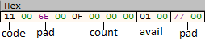
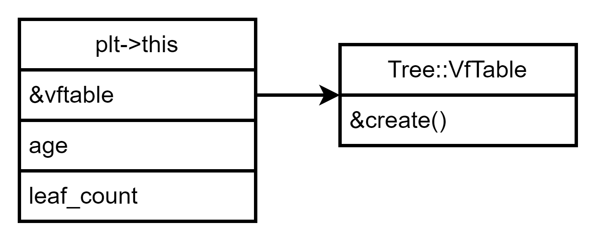

Bir ürünün fonksiyonelliği ve geliştirilebilirliği ne kadar fazla ise o kadar karmaşık bir yapıya sahiptir. Bu karmaşıklık ise fonksiyonel programlamanın önceden efektif olarak kullandığı yazılım geliştirme dünyasında "kaliteli" uygulama ortaya koymayı ise zorlaştırmaktaydı. Fonksiyonel programlamanın yerine daha **üst seviye** bir yaklaşım ile ortaya konan nesne yönelimli programlama paradigması ortaya atıldı ve geliştiricilerin gerçek hayat ile ilişkilendirilebilir kodlar yazarak büyük projeleri daha net ortaya çıkarmasına vesile oldu. 

> Nesne yönelimli programlamanın yazılımcıya sunduğu avantajlar tartışılmaz, peki bir uygulamayı analiz eden tersine mühendis için de aynı koşullar geçerli midir?

Sorunun cevabı net bir şekilde **hayır** olacaktır çünkü klasik (yani fonksiyonel) yaklaşımla kodlanan yazılımlar compiler tarafından olduğu gibi compile edilirken, OOP yapısı kullanılarak kodlanan yazılımlarda compiler farklı yaklaşım ve kuralları uygular. Bu yaklaşım ve kuralları bilmeyen bir tersine mühendis ise bu tarz uygulamaların analizinde zorlanmaktadır. Hele ki polymorphism, dynamic binding gibi ileri seviye OOP nimetlerinden yararlanılıyorsa, bu durum içinden çıkılmaz bir hale bürünüyor. Bu çalışmamızda OOP kullanılarak yazılmış C++ uygulamaların nasıl reverse edilebileceği ile alakalı başlıklara ve detaylarına değineceğim. C++ yapılarını sofistike ve gelişmiş uygulamalarda tanımlamak ve tersine mühendislik süreçlerini kısaltmak bir makaleye sığmayacağı için bunu bir seri haline getireceğim :) 

## Class & Struct Benzerliği

OOP'nin büyük faydalar sağladığını ve kompleks yapıları daha basite indirgeyebildiğinden bahsetmiştik. Burada bir bilinmezlik yatıyor aslında değil mi? Eğer geleneksel programlama ile geliştirilen uygulamaları (ex: C ile yazılmış bir malware) analiz ettiyseniz ve x86 mimarisine ve instruction setine aşinaysanız sizin için o kadar da bilinmez değil. Çünkü bahsedeceğimiz "üst seviye" konseptler aslında bildiğiniz temellerden oluşuyor. 

```cpp
// class_struct.h

class cls_material{
public:
    char code;
    int count;
    bool avail;
};

struct str_material {
    char code;
    int count;
    bool avail;
};
```

Yukarıda tanımladığımız **class** ve **struct** temel olarak aslında aynıdır. Compiler ikisinde de aynı şekile yorumlar ve compile eder. İsterseniz gelin bunu test etmek için implementasyonlarını yapalım. 

```cpp
// class_struct.cpp

    struct str_material gold;
    cls_material copper;

    gold.avail = true;
    gold.code = 17;
    gold.count = 15;

    copper.avail = false;
    copper.code = 18;
    copper.count = 23;
```

Küçük kod örneğinde materyaller hakkında verileri tuttuk. Burada önemli olan bir nokta da kaynakların stackte initialize edilmesi (Dinamik initialization konusuna da değineceğiz). Kaynak kod seviyesinde herhangi bir farklılık olmadığı gözüküyor. Birde dissassemble edip bakalım. 

```nasm
.text:00401000                 push    ebp
.text:00401001                 mov     ebp, esp
.text:00401003                 sub     esp, 18h ; local değerler icin yer ayrılıyor
.text:00401006                 mov     [ebp+var_4], 1 ; gold.avail
.text:0040100A                 mov     [ebp+var_C], 11h ; gold.code
.text:0040100E                 mov     [ebp+var_8], 0Fh ; gold.count
.text:00401015                 mov     [ebp+var_10], 0 ; copper.avail
.text:00401019                 mov     [ebp+var_18], 12h ; copper.code
.text:0040101D                 mov     [ebp+var_14], 17h ; copper.count
.text:00401024                 xor     eax, eax
.text:00401026                 mov     esp, ebp
.text:00401028                 pop     ebp
.text:00401029                 retn
.text:00401029 _main           endp         endp
```

Assembly seviyesinde de herhangi farklılık olmadığı, struct ve classın bellekte kapladığı alana kadar aynı olduğunu ispatlamış olduk. En basit tabir ile classların aslında structlar ile temelde aynı olduğu ve bu iki yapının aslında türlerin bellek adresleri topluluğundan ibaret olduğunu söyleyebiliriz.  

## Class Constructor

C++'da OOP yapısını reverse etmek için tanımamız gereken en önemli konseptlerin başında constructor gelmektedir.  Constructorın **declaration** ve **definitionına** bakalım.  

```cpp
// constructor.hpp

class Material {

private:
    char code;
    int count;
    bool avail;

public:
    Material(char _code, int _count, bool _avail) : code{ _code }, count{ _count }, avail{ _avail }{}

    char getCode();
    int getCount();
    bool isAvail();

};

// constructor.cpp

char Material::getCode() {
    return code;
}

int Material::getCount() {
    return count;
}

bool Material::isAvail() {
    return avail;
}

// main.cpp (Implementation)

int main() {
    Material* gold = new Material(17, 15, true);
    std::cout << gold->getCode() << "\n" << gold->getCount() << "\n" << gold->isAvail();

    return 0;
}
```

Material classımızın constructorı, nitelikleri initialization anında alıyor ve değişkenleri kullanıma hazır hale getiriyor. Ayrıca her bir niteliği return eden ilgili member fonksiyonları da bulunmakta. İmplementasyonunda ise önceki basit class örneğine nazaran **dynamic initialization** kullandığımızı da belirtmekte fayda var.  

```nasm
.text:004012E3                 push    0Ch             ; Class boyutu
.text:004012E5                 call    ??2@YAPAXI@Z    ; operator new(uint)
.text:004012EA                 mov     [ebp+Block], eax
.text:004012ED                 sub     esp, 8
.text:004012F0                 mov     [ebp+var_4], 0
.text:004012F7                 mov     ecx, eax ; eax = Class pointerı
.text:004012F9                 call    sub_401260 ; Material::Material()
```

Constructor çağrılmadan önce class pointerımızı tutacak olan heapten ayrılmış bellek alanı `ecx` registerına atanıyor ve aslında temelde bir member fonksiyonu olan Material classının constructorı (`sub_401260`) çağrılıyor. 

```nasm
.text:00401260                 push    ebp
.text:00401261                 mov     ebp, esp
.text:00401270                 push    esi
.text:00401271                 mov     esi, ecx ; ecx = this pointer
.text:00401273                 push    0Ah
.text:00401275                 mov     byte ptr [esi], 11h ; code 
.text:00401278                 mov     dword ptr [esi+4], 0Fh ; count
.text:0040127F                 mov     byte ptr [esi+8], 1 ; avail
.text:0040129B                 mov     eax, esi ; this pointer return edilmek üzere eax'e taşınıyor.
.text:004012A5                 mov     esp, ebp
.text:004012A7                 pop     ebp
.text:004012A8                 retn    0Ch
```

`sub_401260` fonksiyonunun constructor olduğunu görebiliyoruz. Objemizin gizli belirticisi olan `this` pointerı `ecx` registerı vasıtasıyla constructor içerisinde kullanılıyor. Initialize aşamasında geçtiğimiz parametreler, boyutlarına göre objemiz için ayrılan bellek alanına taşınıyor.  



Obje construct edildikten sonra niteliklerin bellekte dizilimleri yukarıdaki gibidir (Memory padding konusuna ve değişkenlerin boyutuna değinmiyorum).

## Üye Fonksiyon Çağrıları

Örneğimize yine **Material** sınıfımızdan devam edelim. Nitelikler private olarak belirtildiği için sınıf dışından herhangi bir erişim sağlanamayacağından **get** fonksiyonlarını yazdık (yukarıdaki örnekte definitionlarını görebilirsiniz).

```nasm
.text:00401299                 call    sub_401260 ; constructor
.text:0040129E                 mov     edx, eax ; edx = object pointer
.text:004012A0                 mov     ecx, edx ; ecx = object pointer
.text:004012A2                 call    sub_401250 ; Material::isAvail()
.text:004012A7                 movzx   ecx, al
.text:004012AA                 push    ecx
.text:004012AB                 mov     ecx, edx ; ecx = object pointer
.text:004012AD                 call    sub_401240 ; Material::getCount()
.text:004012B2                 push    eax 
.text:004012B3                 call    sub_401230 ; Material::getCode()
```

Obje pointerımız (`this`) vasıtasıyla member fonksiyonlarımızı çağırabiliyoruz. Dikkat etmeniz gereken nokta ise C++ compilerlarının (en azından **MSVC**) bir objenin member fonksiyonunu çağıracağı zaman `this` pointerını `ecx` registerına atamasıdır. Yani sürekli bir şekilde **ecx** kullanımı **OOP** temellerinin kullanıldığına işaret edebilir.  

## Kalıtım

OOP yapısına sınıflar arası ilişki ve extend yapısını kazandıran konsept şüphesiz ki kalıtımdır.  OOP tabanlı geliştirilmiş C++ uygulamalarını reverse etmeyi en çok zorlayan iki temelden (bana göre) birisidir. 

Inheritance konusunu **single** ve **multiple** olarak iki başlıkta incelemek daha faydalı olacaktır. Örneklendirmeler ile hem açıklayalım, hem de reverse edelim :)

### Tekil Kalıtım

Derived classın tek bir base classa sahip olduğu durumdur. 

```cpp
// inheritance.hpp

class Plant {
private:
    int age;
public:
    Plant() : age{ 0 } {};
};

class Tree : public Plant {
private:
    int leaf_count;
public:
    Tree() : leaf_count{ 0 } {}
};

class Fruit : public Plant {
private:
    int water_percent;
public:
    Fruit() : water_percent{ 0 } {};
};
```

Kalıtım söz konusu olunca karşımıza iki önemli kavram çıkıyor: **base class** ve **derived class.** Derived classlar, base classların niteliklerini alırlar. Her bir bitkinin yaşı olduğunu bildiğimizden bu ortak niteliği base classımızda tanımlıyoruz. Ve base classımızı oluşturduğumuz her bir bitki türüne inherit ediyoruz. 

```cpp
// main.cpp

int main() {
    Tree oak;
    Fruit apple;

    return 0;
}
```

İmplementasyonunda görüldüğü üzere base classın niteliklerini derived classlara inherit etmiş olduk. Bizim konumuz olan reverse etme kısmına gelelim ve bu sefer objelerimizi **stack üzerinde** oluşturduğumuzu göz önünde bulunduralım. 

```nasm
.text:004010D0                 push    ebp
.text:004010D1                 mov     ebp, esp
.text:004010D3                 and     esp, 0FFFFFFF8h
.text:004010D6                 sub     esp, 8 
.text:004010D9                 lea     ecx, [esp+8+var_8] 
.text:004010DC                 call    sub_401090 ; Tree::Tree()
.text:004010E1                 lea     ecx, [esp+8+var_8]
.text:004010E4                 call    sub_4010B0 ; Fruit::Fruit()
.text:004010E9                 xor     eax, eax
.text:004010EB                 mov     esp, ebp
.text:004010ED                 pop     ebp
.text:004010EE                 retn
```

Görünüşte ilk olarak derived classların constructorları çağrılıyor olarak gözükse de arkasında yatan temel görünşten tamamen farklıdır. 

```nasm
.text:00401090 sub_401090      proc near               
.text:00401090                 push    esi             
.text:00401091                 mov     esi, ecx
.text:00401093                 call    sub_401070 ; Plant::Plant()
.text:00401098                 push    offset aTreeTree ; "Tree::Tree()\n"
.text:0040109D                 mov     dword ptr [esi+4], 0
.text:004010A4                 call    _printf
.text:004010A9                 add     esp, 4
.text:004010AC                 mov     eax, esi
.text:004010AE                 pop     esi
.text:004010AF                 retn
.text:004010AF sub_401090      endp


.text:004010B0 sub_4010B0      proc near               
.text:004010B0                 push    esi             
.text:004010B1                 mov     esi, ecx
.text:004010B3                 call    sub_401070 ; Plant::Plant()
.text:004010B8                 push    offset aFruitFruit ; "Fruit::Fruit()\n"
.text:004010BD                 mov     dword ptr [esi+4], 0
.text:004010C4                 call    _printf
.text:004010C9                 add     esp, 4
.text:004010CC                 mov     eax, esi
.text:004010CE                 pop     esi
.text:004010CF                 retn
.text:004010CF sub_4010B0      endp


.text:00401070 sub_401070      proc near               
.text:00401070                                         
.text:00401070                 push    esi             
.text:00401071                 mov     esi, ecx
.text:00401073                 push    offset Format   ; "Plant::Plant()\n"
.text:00401078                 mov     dword ptr [esi], 0 ; age = 0
.text:0040107E                 call    _printf
.text:00401083                 add     esp, 4
.text:00401086                 mov     eax, esi
.text:00401088                 pop     esi
.text:00401089                 retn
.text:00401089 sub_401070      endp
```

Şimdi her şey daha net ortada. Derived classların constructorları ilk olarak çağrılıyor gibi gözükse de aslında compiler ilk olarak içinde base class constructorunu çağırıyor. Base class construct edildikten sonra ise derived class içerisindeki diğer öğeler construct ediliyor. Belki kafa karıştırıcı gelmiş olabilir, kodumuzun içerisinde betimleyelim: 

```cpp
Tree() : leaf_count{ 0 } {}
            |
            |
            v              
Tree() {
    Plant::Plant(); // gizli bir çağrı varmış gibi düşünebiliriz
    leaf_count = 0;
}
```

### Çoklu Kalıtım

Derived classın birden fazla base classa sahip olduğu durumdur. Var olan Tree classımızı güncelleyelim ve Forest classını da base class olarak ekleyelim.

```cpp
class Forest {
private:
    int numof_trees;
public:
    Forest() : numof_trees{ 0 } { printf("Forest::Forest()\n"); }
};

class Tree : public Plant, public Forest {
private:
    int leaf_count;
public:
    Tree() : leaf_count{ 0 } { printf("Tree::Tree()\n"); }
};
```

Şu anda 2 adet base classa sahip derived bir classımız var. Hemen disassemble edelim ve ilk önce hangisinin construct edileceğine bakalım.

```nasm
.text:00401090 sub_401090      proc near ; Tree::Tree() constructor             
.text:00401090                 push    esi             
.text:00401091                 mov     esi, ecx ; esi = this pointer
.text:00401093                 call    sub_401050 ; Plant::Plant()
.text:00401098                 lea     ecx, [esi+4]
.text:0040109B                 call    sub_401070 ; Forest::Forest()
.text:004010A0                 push    offset aTreeTree ; "Tree::Tree()\n"
.text:004010A5                 mov     dword ptr [esi+8], 0 ; leaf_count = 0
.text:004010AC                 call    _printf
.text:004010B1                 add     esp, 4
.text:004010B4                 mov     eax, esi
.text:004010B6                 pop     esi
.text:004010B7                 retn
.text:004010B7 sub_401090      endp
```

Base classların parametre geçişlerinin aksine soldan sağa doğru construct edildiğini görebiliyoruz. Class değişkenlerinin initialize değerlerini `leaf_count = 1, age = 2, numof_trees = 3` olarak değiştirelim, Plant classına da `int root_size = 50` niteliğini ekleyip multiple inheritanceda **Tree** classına ait olan objenin bellekte birden fazla member değişkeni ile nasıl dizildiğine de bakalım. 

```nasm
.text:00401070 sub_401070      proc near ; Plant::Plant()               
.text:00401070                                         
.text:00401070                 push    esi             
.text:00401071                 mov     esi, ecx ; esi = Tree this pointer 
.text:00401073                 push    offset Format   ; "Plant::Plant()\n"
.text:00401078                 mov     dword ptr [esi], 2 ; age = 2
.text:0040107E                 mov     dword ptr [esi+4], 32h ; root_size = 50
.text:00401085                 call    _printf
.text:0040108A                 add     esp, 4 
.text:0040108D                 mov     eax, esi ; return this 
.text:0040108F                 pop     esi
.text:00401090                 retn
.text:00401090 sub_401070      endp


.text:004010A0 sub_4010A0      proc near ; Forest::Forest()              
.text:004010A0                 push    esi            
.text:004010A1                 mov     esi, ecx ; Tree this pointer
.text:004010A3                 push    offset aForestForest ; "Forest::Forest()\n"
.text:004010A8                 mov     dword ptr [esi], 3 ; numof_trees = 3
.text:004010AE                 call    _printf
.text:004010B3                 add     esp, 4 
.text:004010B6                 mov     eax, esi ; return this
.text:004010B8                 pop     esi
.text:004010B9                 retn
.text:004010B9 sub_4010A0      endp
```


Multiple inherit uygulamasında derived Tree classı için oluşturulan objenin içeriğini daha net görebiliyoruz. Single'da olduğu üzere sağdan sola olacak şekilde base classın tüm niteliklerini sırasıyla içerdiğini anlamış olduk.

## Polymorphism

**Çokbiçimlilik** anlamına gelen Polymorphism temelde *"başka bir tipte ve birden fazla formda"* davranmayı sağlamaktadır.  Polymorphism biz tersine mühendislerin karşısına en çok **dynamic dispatch** kavramı ile çıkıyor. **Virtual metodlar** base classtan türetilmiş ve override edilmiş olan **most derived classın** aynı (fonksiyonun tipi, parametre sayısı ve tipleri) fonksiyonunu çağırmak için kullanılır ve dynamic dispatch sağlamanın yollarından biridir. 

Yine **Tree** ve **Plant** class örneklerimizden devam edelim fakat bu sefer biraz sadeleştirelim. 

```cpp
// poly.hpp

class Plant {
private: 
    int age;
public:
    Plant() : age{ 20 } {}
    virtual void create() { std::cout << "New plant type created!\n"; }
    void del() {std::cout << "Plant type deleted!\n";
    }
};

class Tree : public Plant{
private:
    int leaf_count;
public:
    Tree() : leaf_count{ 10 } {}
    virtual void create() { std::cout << "New tree created!\n"; }
    void del() { std::cout << "Tree deleted!\n"; }
};
```

Tamamen aynı olan **create()** ve **del()** metodları hem base hem de derived class içerisinde bulunabiliyor. Virtual metodların tam olarak işlevini anlayabilmek için **del()** metodumuzun virtual bir metod olmadığının da farkında olalım. 

```cpp
// main.cpp

int main() {
    Tree* oak = new Tree;
    Plant* plt { oak };

    plt->create();
    plt->del();

    return 0;
}
```

```
output:

New tree created!
Plant type deleted!
```

Virtual metod base class üzerinden çağrıldığında most derived classın metodu çağrılırken, non-virtual metodda ise objeler üzerinde herhangi bir lookup aksiyonu almadan mevcutta çağrıldığı classın (**Plant**) metoduna çağrım yapmaktadır. 

> Peki bu lookup tam olarak nedir, compiler nasıl oluyor da most derived metodu çağırabiliyor?

### Virtual Function Table (VfTable)

Dynamic binding olarak da bahsi geçen virtual fonksiyon çağırma işlemi runtime anında gerçekleşir ve compiler optimizasyonlarından **olabildiğince** bağımsızdır. **VfTable** içerisinde virtual olan her bir metodun adresi sıralı biçimde bulunur ve tablo tarafından dispatch edilirler. 

```nasm
.text:00401030 sub_401030      proc near ; Tree::Tree()
.text:00401030                 call    sub_401000 ; Plant::Plant()
.text:00401035                 mov     dword ptr [ecx], offset ??_7Tree@@6B@ ;&Tree::vftable
.text:0040103B                 mov     eax, ecx
.text:0040103D                 mov     dword ptr [ecx+8], 0Ah ; leaf_count = 10
.text:00401044                 retn
.text:00401044 sub_401030      endp


.text:00401000 sub_401000      proc near ; Plant::Plant()
.text:00401000                 mov     dword ptr [ecx], offset ??_7Plant@@6B@ ; &Plant::vftable
.text:00401006                 mov     eax, ecx
.text:00401008                 mov     dword ptr [ecx+4], 14h
.text:0040100F                 retn
.text:0040100F sub_401000      endp
```

Base class olduğu için **Plant::vftable** referansı, obje pointerına atansa da sonradan **Tree::vftable** referansı yerini alacak ve **Tree::create()** metodu çağrılacak. Öncelikle Tree classından bir obje oluşturup, referansını Plant classına verdiğimizden ötürü compiler vftableları değiştiriyor. **Olabildiğince compiler optimizasyonundan bağımsız** olarak belirtmemizin nedenini de uygulamalı açıklamış bulunuyoruz. 

```nasm
.rdata:00403204 ??_7Plant@@6B@  dd offset sub_401010    ; Plant::create()
.rdata:00403208                 dd offset ??_R4Tree@@6B@ ; const Tree::`RTTI Complete Object Locator'
.rdata:0040320C ; const Tree::`vftable'
.rdata:0040320C ??_7Tree@@6B@   dd offset sub_401050    ; Tree::create()
```

**VfTable** içeriğini de yukarıdaki disassemble çıktısından anlayabiliyoruz. Daha iyi anlamak için **UML** şablonu üzerinden belirtelim ve bellek diziliminde gösterelim.



```nasm
plt: 0C 32 99 00 | 14 00 00 00 | 0A 00 00 00
      &vftable        age         leaf_count


&vftable(0099320C): 50 10 99 00
                   &Tree::create()  
```

Base ve derived class arasındaki vftable paylaşımı ve memory dizilimlerini net bir şekilde açıkladık. 

```nasm
.text:00401073                 call    sub_401030 ; Tree::Tree()
.text:00401078                 mov     ecx, eax ; eax = oak object pointer
.text:0040107A                 mov     edx, [eax] ; [eax] = vftable referansı
.text:0040107C                 call    dword ptr [edx] ; [edx] = Tree::create() referansı
.text:0040107E                 call    sub_401020 ; Plant::delete()
```

Yukarıdaki disassemble parçasında ise vftableın nasıl kullanıldığını görebiliyoruz. İmplementasyonumuzda `Tree::create()` metodunu **override** edip çağırmıştık. Obje pointerının ilk 4 baytında referansı yer alan vftable üzerinden metodu **runtime** anında çağırabiliyoruz. Ardından **virtual** keywordü kullanılmadığı için `Plant::delete()` metodu çağrılıyor ve program sonlanıyor. 

## Referanslar

[Microsoft Word - Reversing_CPP.doc (blackhat.com)](https://www.blackhat.com/presentations/bh-dc-07/Sabanal_Yason/Paper/bh-dc-07-Sabanal_Yason-WP.pdf)

[Reversing C++ programs with IDA pro and Hex-rays – Aris' Blog (0xbadc0de.be)](https://blog.0xbadc0de.be/archives/67)

[Learn C++ – Skill up with our free tutorials (learncpp.com)](https://www.learncpp.com/)
